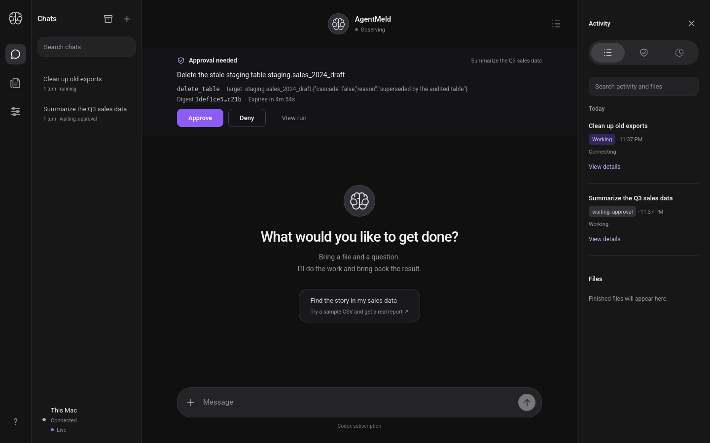
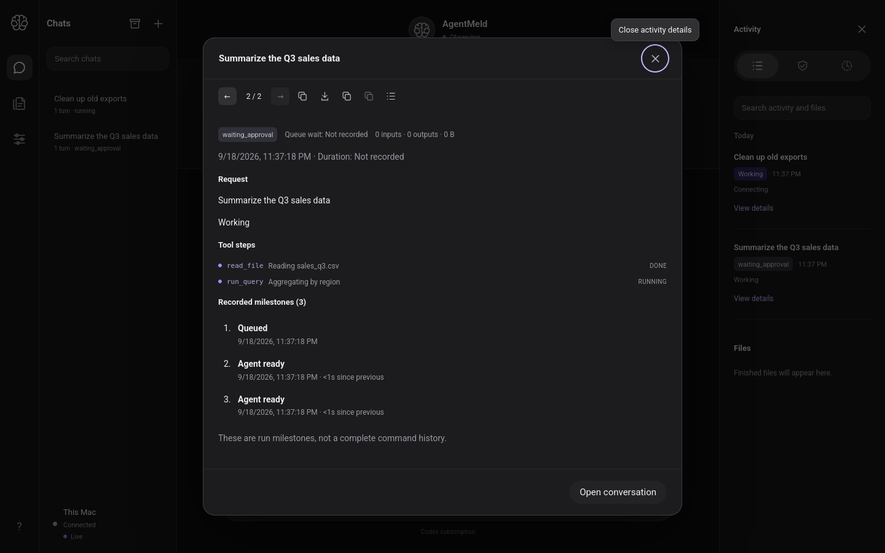
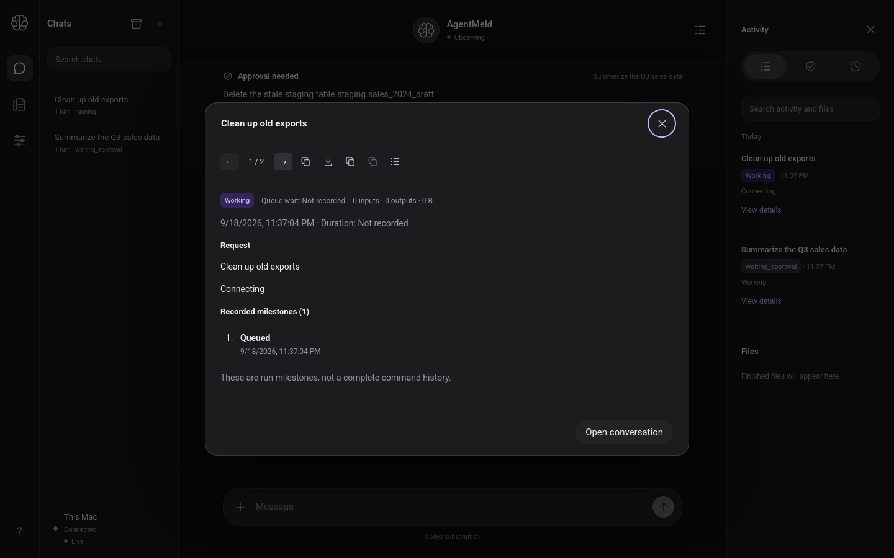

# Client branding UI check — 2026-09-19 UTC

Issue #94. Branch `impl/2026-09-19-client-branding`.

## What changed

Token-only rebrand of the browser UI to the digitalmeld.io direction
(Roboto + shades of purple). No layout or behavior changes; the dark
theme is preserved.

## Decisions

- **Roboto is vendored, not CDN-loaded.** Google Fonts now serves
  "Roboto" v51 as a single variable font (`wght` 100–900). The latin
  subset (43 KB) is vendored at
  `apps/poc/public/fonts/roboto-latin.woff2` and loaded with one
  `@font-face` rule (`font-weight: 100 900`, `font-display: swap`).
  Rationale: the server is local-first and must render identically
  offline; a Google Fonts `<link>` would fail closed on machines
  without internet and leak a request to Google on every load.
  Roboto is Apache-2.0, so vendoring is license-clean.
- **Purple scale (dark-theme tuned):** `--brand-200 #d8ccff`,
  `--brand-300 #c4b5fd`, `--brand-400 #a78bfa`,
  `--brand-500 #8b5cf6`, `--brand-600 #7c3aed`.
  `--accent` → `brand-500`; links and focus rings → `brand-300`;
  status dots and live indicators → `brand-400`. All 27 blue hexes in
  `style.css` were mapped onto this scale; zero blue hexes remain.
- **Approve button now uses `var(--accent)`** (it previously hardcoded
  `#496edb`) so the primary action always tracks the brand token.
- **Both servers serve the font.** PoC `apps/poc/server.mjs` asset map
  and Rust `STATIC_ASSETS` in `crates/agentmeld-server/src/api.rs`
  each gained the `/fonts/roboto-latin.woff2` entry, with a
  `font/woff2` content type on both.
- Georgia (wordmark/avatar) → Roboto; the two non-`:root` font stacks
  (tooltip, root) now lead with Roboto.

## Verification (headless Firefox 1440×900, real `agentmeld-server`)

Recipe: `seed_client_track --state-dir <dir>`, then
`agentmeld-server serve --dir <dir> --port 8471`, POST
`/api/v1/pair` with the single-use token, open `/#<session-token>`.
(Note: `networkidle` never fires as a wait condition — the SSE stream
is a persistent connection; use `domcontentloaded` + explicit waits.
The pair URL printed by the CLI is informational; pairing is a POST
with a JSON body.)

Assertions, all passing:

- `body` computed `font-family` leads with Roboto.
- `/fonts/roboto-latin.woff2` → `200 font/woff2` from the Rust server.
- Approval bar renders; Approve button computes to
  `rgb(139, 92, 246)` (`#8b5cf6`).
- Run-details dialog for the seeded run projects both tool steps
  (`read_file` DONE, `run_query` RUNNING) with purple dots.
- **Zero external network requests** — the UI is fully offline-safe.

## Screenshots

## Files

- `apps/poc/public/style.css` (tokens, `@font-face`, Roboto stacks)
- `apps/poc/public/fonts/roboto-latin.woff2` (new, vendored)
- `apps/poc/server.mjs` (asset map + `font/woff2`)
- `crates/agentmeld-server/src/api.rs` (`STATIC_ASSETS` + `font/woff2`)
