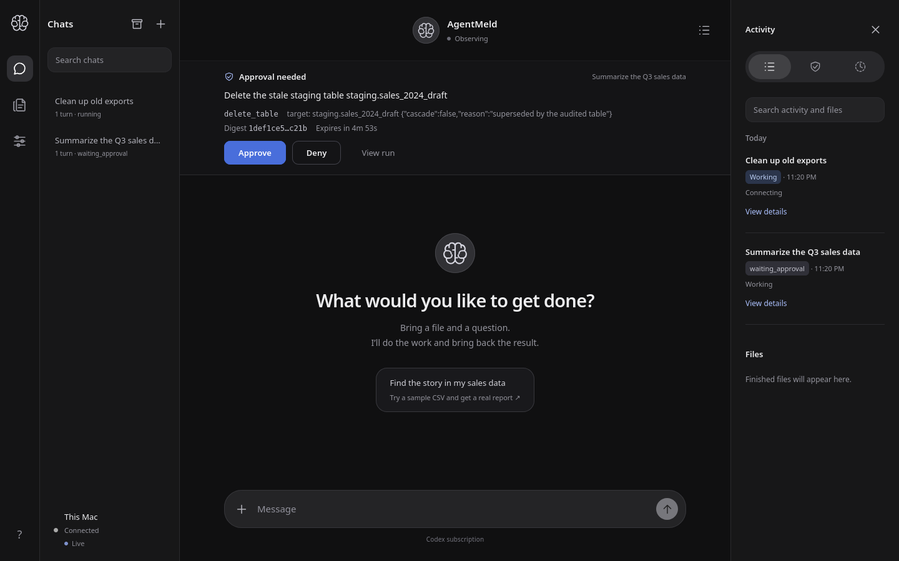
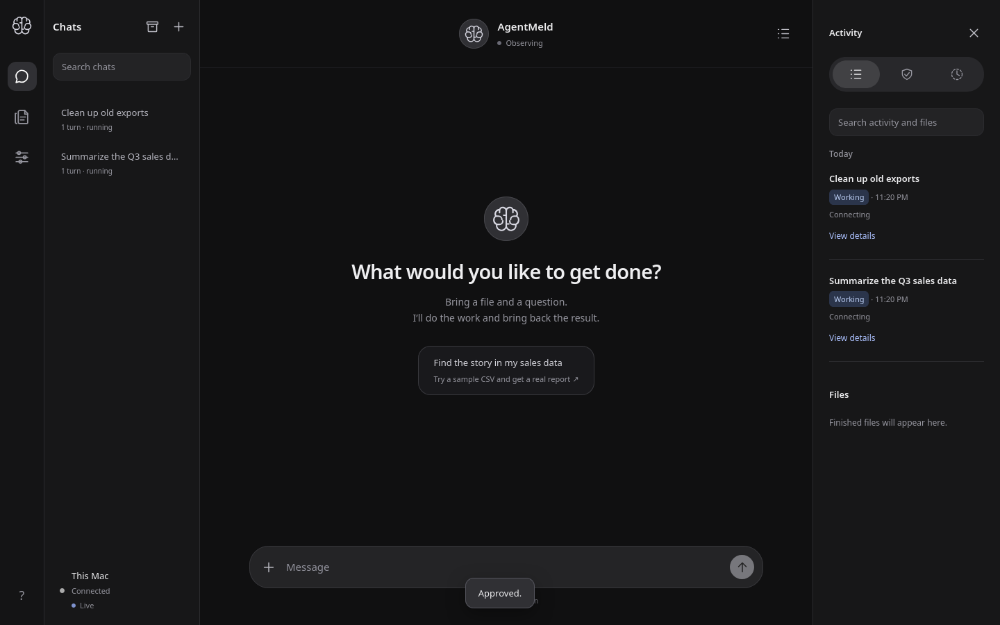
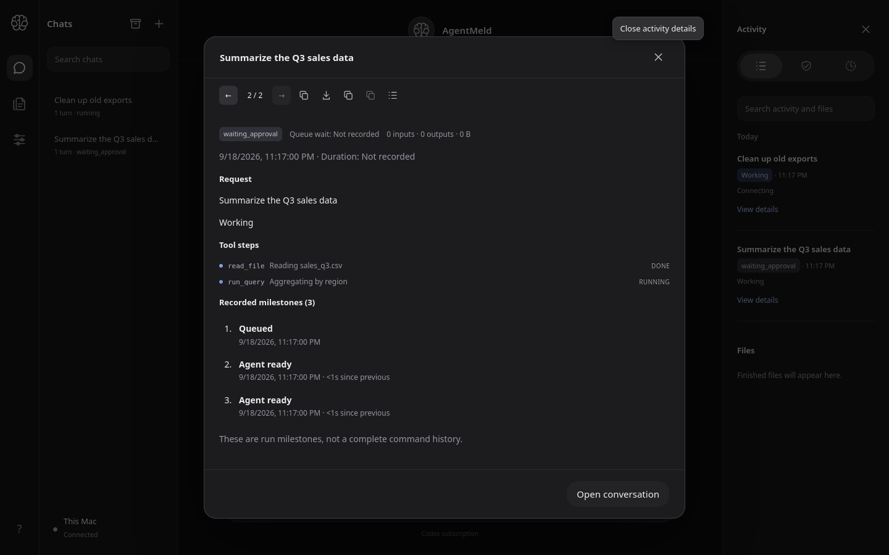

# Client track UI check 2026-09-19 (issue #92)

Wires the browser UI to the approval + event-stream APIs. This is the
client half of the Phase 3/4 server work; the server track is complete
(issues #86, #90).

## What was built

**New:** `apps/poc/public/client-track.js` — browser ES module owning four
things the PoC never had:

1. **Approval prompts** — polls `GET /api/v1/approvals`, renders pending
   approvals with the ChangedAction digest (short hash), a server-time
   expiry countdown, and one-tap Approve/Deny. Decisions POST to
   `/api/v1/approvals/{id}/decision` with the strict
   `{decision, lease_generation}` body. Decision receipts carry state
   only; the module never reads execution-ticket fields.
2. **Live run view over SSE** — authenticated `fetch()` consumption of
   `GET /api/v1/events` with `Last-Event-ID` resume from a persisted
   `localStorage` cursor, in-memory sequence dedupe, exponential-backoff
   reconnect, a 45s liveness watchdog, `410 cursor_too_old` resync via
   REST refresh, and visible connecting/live/reconnecting status.
3. **Controller-lease visibility** — polls `GET /api/v1/lease`, renders a
   pill with honest ownership: "Controlling on this device" /
   "Controlled by another device" / "Human control" / "Observing", with
   the holder in the tooltip. Device identity comes from the new
   `GET /api/v1/session` endpoint (returns the authenticated session's
   non-secret `device_id`; no credentials).
4. **Inline tool steps** — projects `tool.call_started` /
   `tool.call_finished` into per-run step lists in conversation turns and
   in the run-details dialog, including client-side denied/cancelled
   projection when a pending approval goes terminal mid-session.

**New:** `apps/poc/public/sse-parse.js` — pure SSE frame parser (no DOM),
shared by the browser module and Node tests. Handles `retry:` with
clamping (500ms–30s), comments/heartbeats, chunk-boundary reassembly,
CRLF, and multi-line data.

**Server change (1 line):** `stream.hello` now carries `server_time_ms`
(`crates/agentmeld-server/src/events.rs`) so the approval countdown is
anchored to server time. Additive; existing tests only assert
`current_seq`.

**New:** `GET /api/v1/session` — returns the authenticated device's own
non-secret identity (`device_id`, `device_name`), no credentials. The
browser uses it to honestly render lease ownership: "Controlling on this
device" vs "Controlled by another device" vs "Human control"/"Observing".
Covered by `crates/agentmeld-server/tests/session.rs` (2 tests: identity
match + 401 without auth + no credential leakage).

**Bug fixed during verification:** `dispatchFrame` looked for
`stream.hello` inside `event: control` frames, but the server sends it as
`event: stream.hello` — the clock offset was never set. Fixed.

## Verification (2026-09-19 UTC, local)

- `node --check` on `client-track.js`, `sse-parse.js`, `app.js`,
  `server.mjs` — pass.
- `node --test apps/poc/public/sse-parse.test.mjs` — **14/14 pass**
  (framing, chunk boundaries, heartbeats, retry clamping, hello shape).
- `cargo test -p agentmeld-server` — **61 passed, 0 failed** (14 binaries),
  including a new assertion that `stream.hello` carries `server_time_ms`
  within 60s of now.
- **Real server run** against disposable state (`/tmp`, never the repo):
  seeded via a new deterministic binary
  (`crates/agentmeld-server/src/bin/seed_client_track.rs`, uses the real
  `Db::admit` / `apply_worker_events` / `propose_approval` /
  `decide_approval` paths), paired a device, and verified over HTTP:
  - `GET /api/v1/approvals` returns the pending + denied approvals with
    digests;
  - `GET /api/v1/lease` returns the agent state;
  - `GET /api/v1/events` streams `retry: 3000`, `stream.hello` with
    `server_time_ms`, `tool.call_started`/`tool.call_finished`,
    `approval.requested`/`approval.settled` frames;
  - `/client-track.js` and `/sse-parse.js` serve 200 from the static
    allowlist (both allowlists updated: `apps/poc/server.mjs`,
    `crates/agentmeld-server/src/api.rs`).
- Restart-recovery confirmed working: a server restart marks in-flight
  runs `interrupted` and revokes the pending approval with
  `service_restart` (correct production behavior; the seeder re-seeds
  live against the running server).

## Not yet verified

- **Real browser screenshots** — approval prompt, live run with inline
  tool steps, lease pill states. Requires a live-browser session (this
  work was done in a subagent without browser control). The demo server
  recipe is: `seed_client_track --state-dir <dir>`, then
  `agentmeld-server serve --dir <dir> --port 
`, pair, open
  `http://127.0.0.1:
/#<token>`.
- Tool-step hydration after reload (persisted cursor skips historical
  events; no per-run tool-step read endpoint exists yet).
- Branding: styles use the existing PoC tokens; the digitalmeld.io
  Roboto/purple direction is not yet applied.

## Files

- `apps/poc/public/client-track.js` (new, ~540 lines)
- `apps/poc/public/sse-parse.js` (new, pure parser)
- `apps/poc/public/sse-parse.test.mjs` (new, 14 tests)
- `apps/poc/public/index.html`, `app.js`, `style.css` (wired in)
- `apps/poc/server.mjs`, `crates/agentmeld-server/src/api.rs`
  (static allowlists + `GET /api/v1/session`)
- `crates/agentmeld-server/src/events.rs` (`server_time_ms` in hello)
- `crates/agentmeld-server/src/bin/seed_client_track.rs` (demo seeder)
- `crates/agentmeld-server/tests/event_stream.rs` (hello time assertion)
- `crates/agentmeld-server/tests/session.rs` (new, 2 tests)

## Screenshots (verified 2026-09-19 UTC, headless Firefox 1440×900)

Captured against a real `agentmeld-server` run on loopback with the seeded
demo (pending `demo-approval-1`, 5-min TTL; denied `demo-approval-2`; running
run with two tool steps).

### Approval prompt

The approval bar renders at the top of the chat surface: "Approval needed —
Delete the stale staging table staging.sales_2024_draft", the
`delete_table` action with target and arguments, the short action digest
(`1def1ce5…c21b`), a live "Expires in 4m 53s" countdown anchored to server
time, and one-tap **Approve** / **Deny** plus **View run**. The header shows
the lease pill reading **Observing**, and the device footer reads **Live**
(the SSE stream is connected).

### After approving

Clicking **Approve** POSTs the decision, the bar dismisses, and an
"Approved." notice confirms. The run flips to `running` in the chat list and
the Activity panel moves it to **Working**.

### Tool steps in the run-details dialog

The run-details dialog lists inline tool steps under the request:
`read_file` (Reading sales_q3.csv) **DONE**, `run_query` (Aggregating by
region) **RUNNING**, above the recorded milestones.

## Bug found and fixed by this check

The first capture round showed **no approval bar at all** despite a pending
approval: the module polled `GET /api/v1/approvals` successfully (HTTP 200,
pending row present), updated its state, and threw no errors — but never
painted. Root cause: `client-track.js` called `$('#approvalBar')` with a
`#`-prefixed selector, while the `$` it receives from `app.js` is
`document.getElementById`, which takes a bare id. Every lookup returned
`null`, so `paintApprovals`, `paintLease`, `paintStream`, and the approvals
panel all silently no-op'd. Fixed in commit `9f2b85d` (five call sites plus
a contract note at `initClientTrack`); the screenshots above were captured
after the fix and show the prompt rendering, the decision POST succeeding,
and the lease pill reading "Observing".
