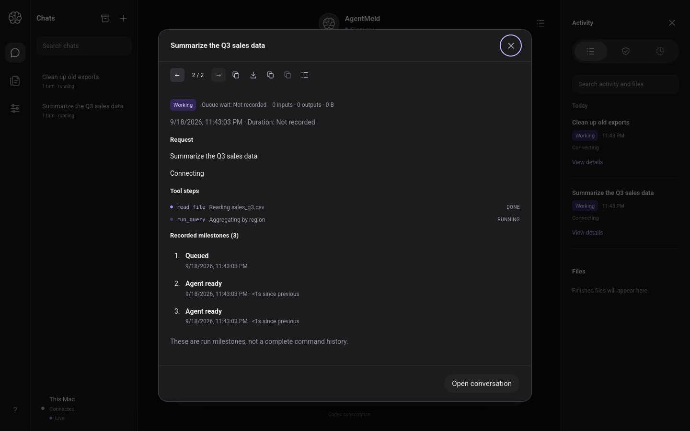

# Final E2E check + MVP-minus-Apple status — 2026-09-19 UTC

Branch `docs/2026-09-19-final-e2e` (docs-only). This is the closing
verification for the web-side track of the M2 public alpha.

## Final end-to-end pass (merged `main` @ `cc5987b`)

Headless Firefox 1440×900 against a real `agentmeld-server`
(seed → serve → pair → browse), asserting the whole client-track
surface at once:

- Brand: `body` font-family leads with Roboto; Approve button computes
  to `rgb(139, 92, 246)` (`#8b5cf6`).
- Approval decision: prompt visible, clicking **Approve** dismisses it.
- Lease pill reads **Observing**; stream indicator reads **Live**.
- Run-details dialog: `read_file` Done / `run_query` Running via the
  SSE projection.
- Reload with the persisted cursor: dialog shows both steps again, and
  the browser observably issued
  `GET /api/v1/runs/{id}/tool_steps` — the hydration backfill, not an
  SSE replay.
- Zero console/page errors. Zero external network requests.

## Suite status (merged `main`)

- `sh scripts/check-local.sh` — green.
- 85 Rust tests workspace-wide (81 baseline + 4 new tool-step
  endpoint tests), 14 SSE parser Node tests, 207 Node experiment
  tests, seccomp checks, docs link/fence validation over 89 Markdown
  files.

## MVP-minus-Apple status (candid)

**The web side of the M2 alpha is done.** All 13 milestones are merged
into `main`:

1. P0 onboarding (#69) · 2. Remote transport: Tailscale Personal (#71)
   · 3. iOS push/background decision (#73) · 4. Control-core
   unification (#75) · 5. Worker/service seam (#77) · 6. Phase 1 PoC
   split (#79) · 7. Phase 2 design (#81) · 8. Phase 2 implementation
   (#83) · 9. Phase 3 design (#85) · 10. Phase 3 implementation (#87)
   · 11. Phase 4 design (#89) · 12. Phase 4 implementation (#91) ·
   13. Client track (#93), branding (#95), tool-step hydration (#97).

What is **verified**: the Rust service (auth, pairing, approvals with
single-transaction ticket consumption, server-time expiry, controller
lease, SSE stream with cursor resume/dedupe, tool-step projection +
hydration), the browser UI against the real service (approval prompts
with ChangedAction digest and countdown, live run view, lease pill,
inline tool steps, Roboto/purple branding, offline-safe with zero
external requests), and the full local suite.

What is **not verified** (explicitly out of this track):

- **Real Codex approval callback** — Phase 3 is "semantically complete,
  callback-unproven" until the Apple-side real-Codex test. Owner: the
  user/Astra.
- **Full worker-turn execution** — no Docker/Codex on this VM; the
  deterministic harness covers the seams.
- **macOS / iOS apps** — excluded from this track by the owner's
  directive ("MVP minus macos and ios"). Cross-network iPhone control
  remains the eventual alpha gate, owned by the user/Astra.

## Screenshot

## Files

- `docs/progress/2026-09-19-final-e2e-mvp-check.md` (this report)
- `docs/progress/assets/final-01-run-details.png`
