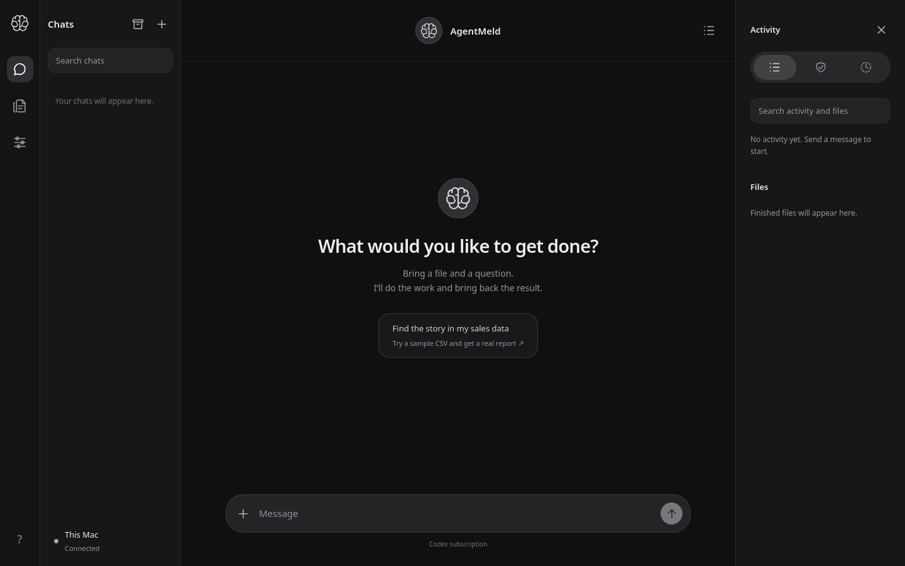
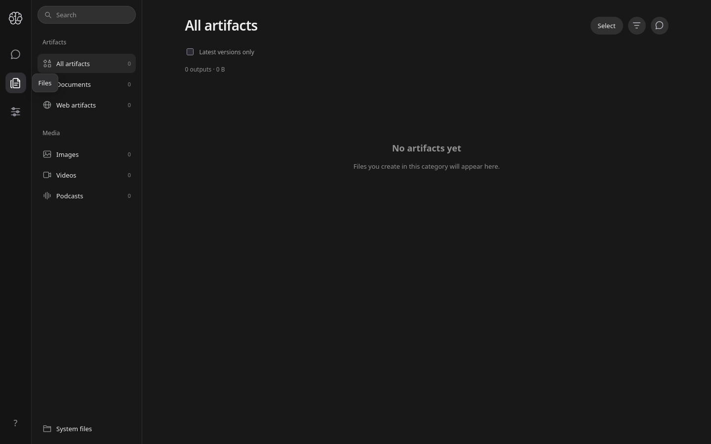
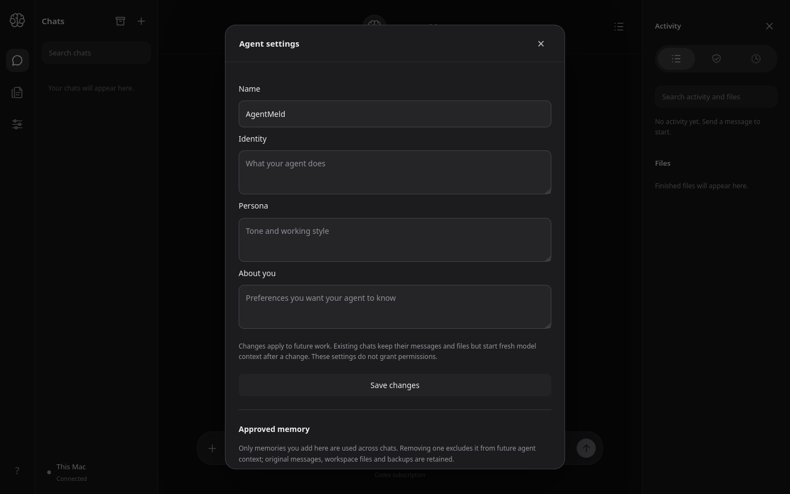

# Progress check 2026-09-19 — Phase 2 UI served by the Rust service

First visual check of the frozen PoC UI served by the new `agentmeld-server`
Rust service (Phase 2 implementation, PR #83). Captured against a real server
instance on loopback with a fresh state directory, using the real device
pairing flow (single-use pairing token → 303 → app). Screenshots taken with
headless Firefox at 1440×900.

## Screens

### Chat (empty state)

Pairing completed, connection status reads **Connected**, rail icons and the
brain avatar render, and the empty state, composer, and Activity panel all
load from the Rust-served API and static assets.

### Files / Library

The Files rail icon switches to the Library: artifact categories (Documents,
Web artifacts, Images, Videos, Podcasts, System files), search, sort options,
and the "No artifacts yet" empty state. Minor visual note: the selected
"Files" pill overlaps the "Documents" row label — this is in the frozen PoC
UI, not introduced by Phase 2.

### Agent settings

The settings gear opens the Agent settings dialog: Name, Identity, Persona,
About you, Save changes, and the Approved memory section.

## Bug found and fixed by this check

The first capture round showed a broken app: no icons, status stuck at
"Connecting…", navigation and dialogs dead. Cause: the Rust static-asset
allowlist in `crates/agentmeld-server/src/api.rs` was stale — it listed 5
entries (`/`, `/app.js`, `/style.css`, `/icon.svg`,
`/manifest.webmanifest`) while the frozen UI needs 13. `app.js` statically
imports 8 sibling modules (`icons.js`, `composer.js`, `tooltips.js`,
`organization.js`, `file-browser.js`, `artifact-tools.js`,
`conversation-tools.js`, `preview-reader.js`, plus `agent-settings.js` and
`brain.svg`), so the 404s failed the whole module graph.

The allowlist now mirrors `apps/poc/server.mjs` exactly (13 entries); the
nonexistent `/icon.svg` and `/manifest.webmanifest` entries are gone.
Rebuilt, re-verified: all 13 assets return 200, unknown paths 404, and the
three screens above were captured against the fixed server.

## Limitations

- Fresh empty state only — no conversation, run, or artifact content exercised.
- No worker turn executed (no Docker/Codex on this host); run/activity live
  states remain unverified.
- Rendered in headless Firefox on Linux, not the owner's macOS browser.
- Pairing tokens and device sessions in the captures are from a disposable
  demo instance; no owner data involved.
