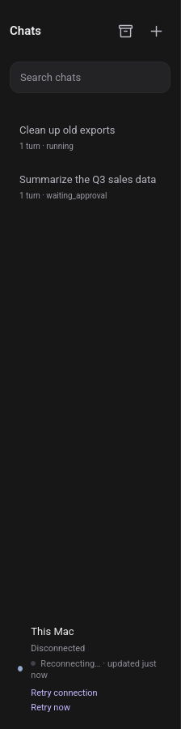

# Stream outage UX: last-updated age + explicit retry (2026-09-19)

## Problem
When the SSE stream stayed down, the sidebar said "Reconnecting…" forever —
no sense of how stale the data was, no way to force a retry.

## What changed
- `apps/poc/public/client-track.js`
  - Tracks `lastEventAt` (last real stream event, not pings/hello).
  - While connecting/reconnecting, the stream label reads
    `Reconnecting… · updated 3m ago` (relative time, rolled over by the
    existing 1s countdown tick). `Live` stays clean.
  - After 2+ failed attempts a **Retry stream** button appears under the
    stream status. It interrupts the current backoff sleep and retries
    immediately; the attempt count is kept so backoff honesty is preserved.
  - `stop()` now also interrupts a backoff sleep, so a stop/start cycle
    can't leave two stream loops running.
- `apps/poc/public/index.html` / `style.css`: the `Retry stream` button,
  styled like the existing `Retry connection`.
- `apps/poc/public/app.js`: **bug fix** — the host block's click/keydown
  handlers opened the Devices dialog for clicks on *any* nested element
  except `#retryConnection`. The new `#retryStream` button sits inside the
  host block, so clicking it opened the Devices dialog as a side effect.
  The handlers now ignore clicks/keydown on any nested `button`.

## Verification
- `scripts/e2e_browser.py`: **37/37** — including a real server kill/restart
  mid-stream: `Reconnecting… · updated …` shows, `Retry stream` appears
  after sustained failure, and the stream returns to `Live` after restart
  (via the retry fast-path when still offered, else via backoff).
- E2E detour worth recording: Playwright `page.route(...).abort()` only
  affects *new* requests, not the already-open SSE stream, and
  `context.set_offline(True)` does not tear down the open stream in this
  Firefox build (the read just hangs). Killing the server process is the
  deterministic outage simulation; `restart_server()` in the E2E boots it
  back on the same port/state dir.

