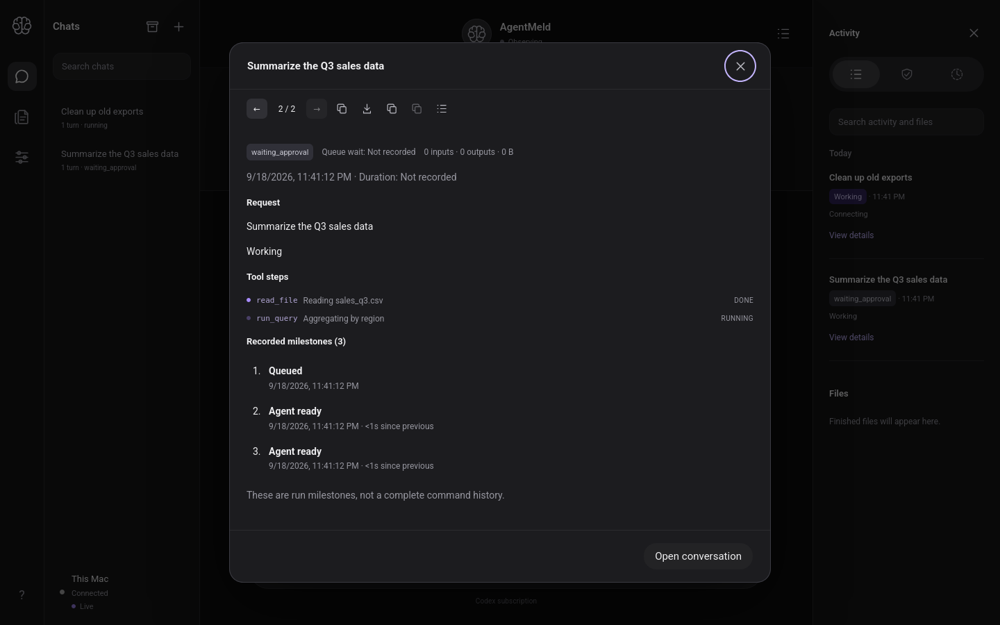

# Tool-step hydration UI check — 2026-09-19 UTC

Issue #96. Branch `impl/2026-09-19-toolstep-hydration`.

## The gap

The browser projects tool steps from SSE `tool_step` events into a
per-run map (`apps/poc/public/client-track.js`). The SSE client persists
its cursor, so after a reload the resumed stream skips already-consumed
events — and the run-details dialog then showed no tool steps for runs
that already had them. The server persisted the projection (`tool_steps`
table, `Db::tool_steps_for_run` — whose docstring already said "Used by
the (future) UI") but exposed no read endpoint.

## Decisions

- **New endpoint: `GET /api/v1/runs/{id}/tool_steps`.**
  Device-authenticated, 404 `unknown_run` for a bad id, steps in
  service-assigned ordinal order as
  `{call_key, tool, title, state}` — shaped to drop straight into the
  client's step map. It returns the whole persisted projection for the
  run, including service-written approval-gate rows (denied/cancelled),
  which the dialog already renders.
- **Merge rule is insert-if-absent on the worker-stable `call_key`.**
  Live SSE state always wins for in-flight steps; the fetch only
  backfills what the resumed stream skipped. A step that finishes after
  the fetch still transitions via its SSE event, because the stream is
  already live before hydration runs.
- **One fetch per run per page load, never retried.** A completed fetch —
  success or failure — marks the run hydrated. The SSE stream stays the
  live source of truth; hydration is a best-effort backfill.
- **Dialog re-renders on hydration.** `renderDetails()` only renders the
  "Tool steps" section when steps are known, so after hydration adds
  entries it re-renders the open dialog for the same run (guarded on
  `detailId` and dialog-open). Turn-level step containers always render
  their (possibly empty) div, so `paintSteps()` kicking hydration covers
  them uniformly.
- **Unknown DB states map to `unknown`** client-side rather than
  rendering raw strings.

## Verification

- `cargo test -p agentmeld-server --test tool_steps` — 13 passed,
  including 4 new endpoint tests: persisted steps in ordinal order with
  the expected shape, empty steps for a step-less run, 404
  `unknown_run`, 401 without auth.
- `sh scripts/check-local.sh` — green.
- Headless Firefox 1440×900 against a real `agentmeld-server`, the
  actual bug scenario:
  1. Fresh load: dialog shows `read_file` Done / `run_query` Running
     (SSE projection); cursor persisted (`agentmeld.eventCursor`).
  2. Reload: dialog shows both steps again — and the browser observably
     issued `GET /api/v1/runs/{id}/tool_steps`, proving the backfill
     path rather than an SSE replay.
  3. `curl` on the endpoint for a bad id → 404.
- Note: the demo server revokes pending approvals at boot
  (`service_restart` — intended behavior), so the seeder must run live
  against the running server for a pending-approval scenario, exactly as
  the client-track doc prescribes.

## Screenshot

## Files

- `crates/agentmeld-server/src/api.rs` (route + handler)
- `crates/agentmeld-server/tests/tool_steps.rs` (4 endpoint tests)
- `apps/poc/public/client-track.js` (`hydrateSteps`, `paintSteps` hook, export)
- `apps/poc/public/app.js` (`renderDetails` re-render on hydration)
