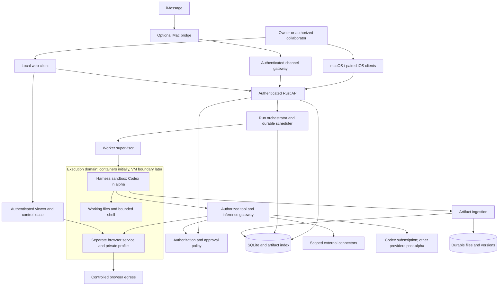
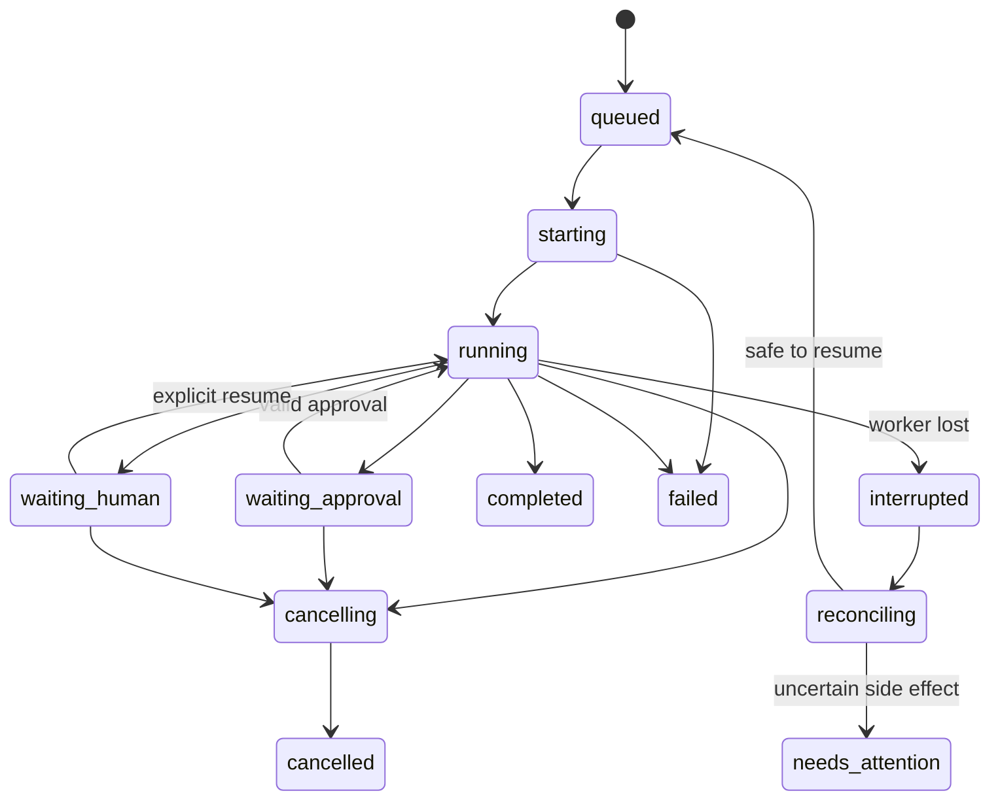

# AgentMeld architecture

Updated: 2026-09-18. Status: proposed product architecture; M0 experimental components exist, but the production system is not implemented. Read alongside the [product specification](product-spec.md) and [runtime evidence](../research/runtime-integrations.md).

Current scope: [Apple-first alpha](../decisions/2026-09-18-apple-first-alpha.md). Messaging architecture below is retained for post-alpha; it does not gate M0/M2.

## 1. System shape

Use a Rust service for the trusted application core, macOS/iOS native clients and a local browser client, and independently supervised execution environments. Ship a modular monolith before introducing distributed services. Keep infrastructure management outside every environment that can execute generated code.

Arrows denote intended data paths, not a claim that all libraries already support brokered access. Harness authentication and egress compatibility are M0 experiments. A deployment that cannot enforce its declared boundary must expose the limitation or refuse that configuration.

## 2. Proposed components and language boundaries

| Component | Technology proposal | Responsibility |
| --- | --- | --- |
| Apple clients | Proposed SwiftUI, shared Swift API/event models | Native macOS/iOS task, approval, artifact and computer surfaces over the same service API |
| Web client | React, TypeScript, Vite | Conversation, inspector, viewer, library, setup and policy UI |
| `agentmeld-server` | Rust, Tokio, Axum | API, auth checks, run state, scheduler, event replay, artifacts, budget admission |
| `agentmeld-worker` | Rust | Narrow privileged runtime manager, child supervision, quotas, leases, health and recovery |
| Native Codex adapter | Rust protocol client | Private stdio app-server session and approval/event normalization |
| Native Claude adapter, post-alpha | Small TypeScript Agent SDK bridge | Supported SDK integration with explicit permissions and streaming |
| AgentMeld harness, post-alpha | Rust | Bounded model/tool loop, initially Ollama HTTP |
| Browser service | Chromium and a small Playwright service | DOM tools, screenshots, protected profile, navigation and action control |
| Desktop viewer | Existing maintained remote-viewing components | Authenticated image/input transport and takeover; select after M0 review |
| Initial database | SQLite WAL with migrations | Single-node metadata, transcripts, durable jobs, outbox, approvals and leases |
| Optional iMessage bridge | Owner-controlled macOS transport plus scoped bridge | Receive/send messages and report delivery without hosting agent execution |
| Initial artifact store | Local filesystem plus database metadata | Immutable artifact versions and scoped retrieval |

These are proposed dependencies, not installed packages or selected versions. Pin maintained versions during M0; review their licenses and runtime distribution requirements before packaging. No custom browser engine, VMM, inference engine, or cryptography implementation. SwiftUI is the proposed Apple client direction; qualify packaging and viewer integration before implementation. Keep business rules in Rust and use the same versioned API from Swift and TypeScript. Native clients must not create a second execution architecture.

Rust is most useful for long-lived supervision, concurrency, authorization, I/O, and a small distributable service. Keep native SDK bridges where the supported ecosystem requires them. Avoid a pure-Rust requirement that leads to reimplementing vendor protocols without evidence of savings.

## 3. Four independent contracts

**HarnessAdapter** runs a task. Operations: discover capabilities, validate configuration, start, resume, steer, interrupt, respond to approval, stream events, and close. Capabilities are versioned and include tools, images, browser DOM, pixel control, durable continuation, usage, and accepted/refused/unknown steering. It reports native session references privately.

**ModelProvider** supplies inference to a compatible harness. It handles model discovery, authentication reference, input limits, streaming, tool-call format, usage, and error mapping. Native Claude Code/Codex adapters retain their own provider configuration rather than being forced through the generic HTTP loop.

**ComputerProvider** provisions and supervises an execution domain. Operations: create, start, inspect, stop, checkpoint, restore, export, and destroy after an explicit lifecycle decision. Checkpoint/restore capabilities distinguish durable file/disk recovery from suspended memory/process snapshots; the container alpha promises only qualified durable-state recovery. The handle includes owner/workspace, image digest, runtime identity, resource limits, and supported isolation class. Never accept a caller-supplied arbitrary container ID as sufficient ownership proof.

**ToolProvider** exposes typed, versioned operations, required scopes, input/output schemas, timeout/size limits, and side-effect classification. Unknown classification defaults to review or denial. MCP is a transport, not a grant. Connecting an MCP server does not authorize all of its tools or make its descriptions trustworthy.

Alpha exposes **Codex**, authenticated through the owner’s supported ChatGPT subscription login. **Claude Code** and **Ollama** presets arrive after their post-alpha qualification. Advanced settings reveal the harness/model/computer distinction only when needed. Each run freezes its configuration version. Switching provider between turns creates or resumes a compatible session; incompatible native state is replaced with reviewed authorized context, not silently transplanted.

## 4. Alpha adapter and future integrations

**Claude Code (post-alpha):** start a pinned Agent SDK bridge inside the harness sandbox. Normalize SDK messages into AgentMeld events and bridge unresolved permission requests to the approval service. SDK callbacks are not a universal interception layer; deny/ask rules and the external execution boundary remain necessary. Revisit supported subscription authentication first when this post-alpha adapter begins; use API/cloud alternatives only by an explicit product decision. Do not import a host's entire Claude configuration directory or promise subscription credential routing. [Official integration and auth evidence](../research/runtime-integrations.md#claude-code-details-and-authentication-boundary).

**Codex:** supervise `codex app-server` inside the harness sandbox over private stdio. Generate protocol schemas from the same pinned binary. Persist thread/session mapping, handle command/file approvals, and distinguish turn completion from process exit. Never expose the app-server directly to clients. Use the supported ChatGPT subscription login flow, with no API-key requirement. Login may require owner interaction; preserving dedicated credentials is an explicit setup step. Do not copy personal host auth directories. See [subscription qualification](../m0/codex-subscription.md). [Protocol evidence](../research/runtime-integrations.md#codex-details-and-authentication-boundary).

**Ollama (post-alpha):** provide a real Rust agent loop: prepare authorized context, call chat, accumulate a complete tool request, validate schema and policy, execute within quotas, append the result, and continue until completion or budget/step limit. Never execute partial streamed JSON. Capability-tested models may use DOM tools; pixel tools additionally require qualified image support. Store durable model configuration and normalized history; an unsupported model produces a clear setup error. Local-only mode rejects cloud model routes and cloud fallbacks. [API and local-only evidence](../research/runtime-integrations.md#ollama-details-and-capability-limits).

Ollama inference may run on a dedicated host service to retain GPU acceleration and avoid one model copy per agent. Expose only its authorized inference interface to the sandbox; do not grant access to the surrounding host network. On macOS, do not assume a Linux VM preserves native Metal acceleration.

## 5. Execution and trust boundaries

### Trusted single-owner installation

Start with an isolated Linux execution domain per agent/private context. Separate the harness container from the browser service/profile within that domain. Native shell access must not let generated code read browser cookies, the database, supervisor socket, master keys, or another computer's files. Model-provider credentials require a narrow inference broker when supported; otherwise use a documented limited credential exposure and refuse shared/hosted operation until qualified.

Use non-root processes, dropped capabilities, `no-new-privileges`, seccomp, read-only base images where possible, explicit writable volumes, CPU/memory/PID/disk quotas, and bounded logs. Never mount the Docker socket, host home, SSH agent, cloud metadata credentials, or application database inside a harness. The worker alone can manage the engine. A Docker installation may itself run inside a VM on macOS/Windows; that does not make each agent a separately isolated VM.

Permit harness networking only to authenticated inference/tool gateways and necessary explicitly selected provider endpoints. Tool/backend SSRF defenses must check parsed URLs, DNS resolution and rebinding, redirects, IPv4/IPv6, link-local metadata, and private destinations. Private-network connections such as an owner-selected Ollama server require explicit configuration; do not ban legitimate local inference while silently permitting arbitrary private URLs.

Use separate browser profiles per private/shared execution domain. Persist only declared workspace directories, profile state, and required provider continuation. The browser profile is sensitive retained data, not a generally downloadable artifact. The user's everyday browser profile is never copied automatically.

### External collaborators and hosted tenants

An unrelated guest's submitted content is an untrusted input to an already tool-capable agent. Admission therefore requires scoped sessions and qualified isolation before invitations ship. Use a dedicated VM or microVM for each untrusted workspace trust domain; constrain containers within it. Firecracker is a later Linux/KVM candidate, not the universal local runtime. A dedicated conventional VM is an acceptable first hosted boundary. Do not build a VMM.

Sharing an agent definition copies identity/instructions and explicitly selected memory. Sharing live access uses a separate shared agent session and computer, not the owner's private continuation. Sharing artifacts, conversations, computers, and connections are distinct grants. When intentionally sharing a computer, all participants must understand its shared files/logins. Separate tabs or screen leases do not provide data isolation.

Inviting a participant requires an explicit historical-access scope. Default to a new context with a reviewed handoff summary; granting full prior conversation/artifact access is a separate choice. Hiding old UI messages does not remove them from a provider's existing context.

### Security limits that must remain visible

Code-enforced policy can constrain which tools, accounts, origins, and resources are reachable. It cannot perfectly determine the business meaning of an arbitrary browser click or shell command. A logged-in browser may perform remote changes using existing sessions. Semantic/model review supplements capability isolation; it is not proof that every consequential action is intercepted. Unknown browser actions pause for review. Restrict authenticated browsing in shared environments until its boundary is tested; some sites require human completion.

## 6. Identity, authorization, and secret ownership

Every record carries workspace ownership from the start, even in single-owner mode. The server derives actor identity from its authenticated session, never a request's claimed `actor_id`. Model outputs, retrieved text, imported skills, and agent messages cannot create membership or approve actions.

Proposed principals: user, agent, and system scheduler. Proposed roles: owner, administrator, member, and guest. Roles provide defaults; explicit resource grants control view, contribute, run, approve, connect, and administer. Administrative access does not automatically authorize use of another person's connection.

Effective run permissions are the intersection of initiating actor grants, workspace policy, agent grants, credential-owner consent, and the run's approval scope. Delegated runs may only narrow these capabilities. Scheduled runs recheck the schedule owner's current grants on each dispatch. Revocation invalidates cached grants, pending approvals, stream subscriptions and future dispatch; it cannot undo completed external actions.

When grants narrow, quiesce or cancel affected runs and invalidate their assembled context and provider-native continuation. Rebuild from currently authorized inputs before any further model request or tool dispatch. Removing a person from the UI is insufficient while their prior permissions remain embedded in a live session.

The local web/API endpoint defaults to loopback and requires an owner session, strict Host/Origin validation, CSRF protection where applicable, and authenticated event/viewer endpoints. Localhost is not a substitute for authentication. iOS pairing explicitly enables a secured reachable endpoint; do not silently bind to the LAN. Enroll devices with a short-lived single-use challenge, owner confirmation, scoped sessions and revocation. Cross-network iPhone and Mac-to-Mac use require one qualified private route or relay for alpha; remote web availability is not implied. Remote exposure is refused without the supported TLS/auth configuration. For M3, select an established identity implementation or OIDC integration and validate ordinary-user access. Do not invent a password-auth system during the prototype.

Keep credential values out of client responses, logs, prompts, memory, and artifacts. Store references in domain rows. Initial self-host secret storage uses established authenticated encryption with a separately supplied master key; optional OS keychain integration can follow. Backup and key recovery procedures must be explicit. Hosted credentials use a managed secret system with per-tenant access. Compatibility tests must document any native harness that can access an injected credential; do not claim it is invisible to the runtime merely because the UI masks it.

## 7. Domain model and persistence

| Entity | Key semantics |
| --- | --- |
| Workspace, Membership, Grant | Ownership, actor capabilities, revocation version |
| Agent, AgentRevision | Identity, instructions, default adapter, approved memory scope |
| Conversation, Message | Participants, visibility, immutable origin, ordered user-facing history |
| Run, RunEvent | Initiator, frozen config, parent delegation, budget, status, sequenced events |
| Action, Approval | Exact payload digest, target, scope, expiry, approver, execution receipt |
| Computer, Lease | Runtime identity, image digest, owner domain, controller and fencing generation |
| Artifact, ArtifactVersion | Immutable content hash, media type, size, visibility and producer run |
| WorkRecord, WorkRevision | Bounded ongoing-work summary, source references, linked runs, expected revision and deletion tombstone; never execution authority |
| MemoryEntry, MemoryRevision | Source, scope, revision, confidence/status and retrieval eligibility |
| Connection, CredentialRef | Credential owner, granted tools/scopes, expiry, metadata without values |
| Skill, SkillVersion | Declared inputs/capabilities, content hash, review and enablement |
| Schedule, TriggerDelivery | Timezone, recurrence, next run, deduplication key and missed-run policy |
| ChannelBinding, ChannelDelivery | Transport account/chat/sender binding, workspace/conversation, native message IDs, direction, retry state and receipt |

Use SQLite transactions for job admission, lifecycle events, and the outbox. A single writer with short transactions and bounded batches is sufficient for initial scope. Store schema-versioned migrations with pre-migration backup and restore tests. Do not expose database-native IDs or session cursors as authorization.

Write artifact bytes to staging, calculate a hash and size, atomically promote to immutable storage, then commit metadata. Reconcile orphaned files after interruption. Quotas apply before ingestion; do not trust extensions, paths, archives, or symlinks. Serve active HTML from an isolated origin with sandbox restrictions and no access to application cookies or implicit network/tool capabilities.

Provider sessions and native working files are separate from normalized events. A completed provider session is not a filesystem backup. Back up the database, artifact versions, approved persistent workspace/profile state, and necessary secret material under separate access controls. Restore onto an isolated target and verify consistency before declaring recovery successful. Do not call latest-only synchronization historical backup.

A consistent backup blocks new dispatch, settles active writes, quiesces browser/profile writers, uses SQLite's supported backup mechanism, and records a content-hash manifest for the matching file checkpoint before resuming. Never call a raw copy of a live WAL database or browser profile verified backup. An interrupted checkpoint is incomplete; retain the last verified generation, reconcile pending actions, and rebuild a fresh checkpoint.

Postgres and object storage arrive when multi-node coordination or measured write contention requires them. Keep domain storage operations explicit, but do not build and maintain two database dialects at alpha. Migration is a tested milestone with export/import parity, ownership preservation, backup, and rollback.

## 8. Run lifecycle and recovery

All nonterminal states accept cancellation, including queued/starting/reconciling; the diagram shows representative paths. A denial is recorded and returned to the harness, which can choose another authorized path or finish with a limitation. It never falls through to execution. Failed startup cannot be marked complete. Completion requires an actual harness terminal result and recorded output, not the absence of messages.

Use one durable event envelope: schema version, event ID, workspace/run IDs, monotonically increasing sequence, server time, actor, event type, and bounded payload. Types cover messages, tool proposal/result, approval, artifacts, usage, status, and terminal outcomes. No hidden chain-of-thought is required for observability. Stream user-facing events through SSE with cursor replay; use a separate authenticated bidirectional channel for desktop control. Reconnects must not duplicate messages or tool calls.

Each worker lease has a generation/fencing token. A stale process loses permission to dispatch after lease expiry or takeover. Cancellation blocks new tools first, interrupts the harness/process group, then escalates to sandbox termination if needed. On restart, reconcile actual processes and durable state before resuming. API acceptance, provider acceptance, and external action completion are different receipts.

Delivery is at least once with idempotent handling, not a universal exactly-once guarantee. If a remote write times out after submission, mark the outcome unknown and check the destination using its idempotency key/receipt where possible. Otherwise require human reconciliation. Retrying an entire run must not replay its completed writes.

### Result and notification lifecycle

Persist validated result bytes first, then commit their result reference and notification intent atomically in the database/outbox transaction. Track run completion independently of report submission and transport delivery. A failed or suppressed notification cannot reopen or rerun the task. Retain an immutable reply target (workspace, channel binding, conversation, optional native message anchor, grant version) and stable delivery/chunk IDs. Recheck grants before sending. On ambiguous submission reconcile before retry; missing reply anchors permit same-chat fallback only after definite rejection. Never infer recipient delivery from API acceptance. Test server loss between result commit, outbox admission, send and receipt.

### Bounded browser assignments

Normalize browser work as a typed assignment: objective, permitted context/artifact references, computer identity and lease generation, grants, deadline, budget and frozen role configuration. One worker suffices initially; this does not introduce an always-running coordinator or require multi-agent fan-out. Its structured result includes completed/blocked/cancelled/failed/uncertain status, evidence and artifact IDs, remaining steps, and any explicit input request. Validate those references and authorization in the control service. A success label or prose claim cannot settle an uncertain side effect. Each role uses a qualified configured harness/model, including local-only restrictions; no hidden specialist cloud model.

## 9. Approvals and computer control

An approval is bound to workspace, initiator, run, action digest, exact target, credential grant version, policy version, lease generation, and expiry. The client submits the approval ID and decision; the server resolves current authorization and payload. Consuming an approval and admitting execution uses a transaction. A terminal, expired, or superseded approval cannot be reused.

Allow once is the default. Optional task-scoped grants require explicit action/resource limits and expiry. Broad permanent allow rules are advanced settings, never inferred from conversation sentiment. Self-host administrators may choose their own policies, but weakening them must be explicit and visible.

The computer has one authoritative controller lease. Takeover stops further automated inputs, settles the active command, records paused state, and then enables human input. Disconnect does not auto-resume. Resume invalidates stale page references and obtains a fresh observation. Credential entry suspends model observations and screenshot persistence; verify that paused recording actually excludes sensitive frames. No secret-disclosure guarantee is made until tested.

Future credential autofill must use opaque credential handles and trusted origin/frame resolution, with current owner grants and computer lease checks. Derive secret values only in the trusted fill service. Protected human entry remains the initial path; do not add a payment vault to alpha. Before enabling autofill, test secret canaries across all DOM/text, screenshots, traces, errors and artifact paths, including redirects, hostile frames and page mutation. Screenshot masking alone does not establish secret exclusion, and filling a form never authorizes submitting a purchase.

## 10. Scheduling, memory, skills, and delegation

The scheduler waits on the next due time instead of continuously asking a model whether there is work. Persist timezone and recurrence interpretation, deduplicate trigger deliveries, bound concurrent runs, and define retries/backoff. Recheck policy and remaining budget before every run. Model-driven monitors notify on meaningful changes; reminder delivery is deterministic. Webhooks must authenticate, deduplicate, and constrain which workflow they can trigger.

### iMessage as an independent channel, post-alpha

Add a **ChannelAdapter** outside the harness/model/computer contracts. It receives normalized inbound messages, submits authorized outbound deliveries, reports delivery state, and reconnects using durable cursors. It does not execute agent tools or own a second conversation store. The web client and iMessage address the same conversations and run records.

Proposed path: iMessage → owner-controlled Mac transport → narrow AgentMeld bridge → authenticated channel gateway → actor/chat binding → normal run admission. Replies use a durable outbound queue through the paired bridge. The core server and agent computer remain Linux-compatible; only the optional iMessage transport requires macOS. Review the [iMessage research](../research/imessage.md) before selecting a bridge implementation. Do not guess Instinct's transport from its product experience.

Enroll the bridge explicitly with a scoped device credential and revocation control. Prefer an outbound authenticated connection from the Mac; no public Messages database, remote AppleScript endpoint, or unauthenticated webhook. The adapter receives only messaging capabilities. It never gives agents the Mac shell, Apple account credentials, address book, or unrestricted Messages history. OS-required permissions and the difference between technical access and app-level filtering must be disclosed during setup.

BlueBubbles and imsg are self-host transport candidates to compare under one conformance suite; neither is selected. Linq is a separate managed-hosting candidate, subject to terms, provisioning and operational qualification. Scope the first messaging increment to capabilities that work with macOS System Integrity Protection enabled. Do not require private-API features or weakening SIP for ordinary messages. Native threaded replies, reactions, typing indicators, and group administration are capability-dependent and outside the initial requirement; an ordinary text response is sufficient. Full Disk Access may grant the transport broader local access than AgentMeld's allowlist, which is why a dedicated Mac/account is preferred and the bridge's trust boundary must be explicit.

Bind service/account, native chat ID, and verified sender address to a principal. Use explicit pairing and an allowlist, not display names or phone text inside the message. A dedicated messaging identity is preferred to avoid confusing owner-sent messages with bot replies. Transport experiments must prove the selected identity arrangement supports two-way use. Ignore outbound echoes, deduplicate by native message ID, bound attachment types/size, and isolate attachment parsing. Persist inbound delivery before acknowledging it. Keep transport credentials separate from run credentials.

Outbound identity is the sending address actually configured in Apple Messages. An agent name does not create a new iMessage number/account. Multiple agents may share one transport identity with explicit chat routing; separate identities require separate qualified provisioning. Require iMessage transport explicitly, without silent SMS/RCS fallback.

BlueBubbles webhooks are wake-up hints, not authenticated durable messages. Read the referenced event back through the local API, validate its chat/sender, and relay only the filtered envelope with AgentMeld authentication. Recover missed events using bounded overlapping history catch-up and native-ID deduplication. Keep API credentials local and redact credential-bearing query strings from logs. API-only setup dependencies, including whether Firebase can be omitted, remain an M0 qualification question.

Queue replies durably and distinguish queued, submitted to bridge, confirmed sent, delivered, failed, and unknown according to actual transport capabilities. Never invent read/delivery receipts or resend blindly after an uncertain send. When the Mac is asleep or disconnected, show stale connectivity and retain the queue with bounded retry/expiry. Local model availability does not make the bridge always-on.

The Messages transport protection ends when the Mac hands plaintext to AgentMeld. Use authenticated encryption for the bridge connection and disclose whether the selected model sends conversation data to a cloud provider. Do not describe the whole agent workflow as end-to-end encrypted merely because its first hop is iMessage. Filter authorized chats before retention/forwarding and make any historical import an explicit separate operation.

Map long replies into stable chunks with correlation IDs; large/active artifacts use authenticated expiring links instead of public URLs. Notification preferences apply to scheduled messages and meaningful-change alerts. Initial approvals use expiring deep links to the authenticated web review, bound to the existing action and actor. Do not use bearer approval URLs that a forwarded message could redeem. Group chats are deferred until membership, sender permissions, and history visibility pass conformance tests.

Mobile approval links require a supported private-network or authenticated HTTPS route to the single-owner instance. Loopback addresses work only on the server's computer. Messaging setup must either qualify that private route or direct the owner to review on their computer; it must not silently expose the server publicly. Link previews are read-only and never consume an approval.

The same channel interface later supports other messaging services. A future hosted iMessage option needs separately verified provider terms, identity provisioning, operations, and privacy; the self-host bridge does not automatically establish a scalable commercial transport.

Add bounded work records for cross-conversation continuity under the same owner-approved memory policy: objective, constraints, decisions, source-linked observations, unresolved steps and run references. Retrieve a small index then selected records instead of injecting complete histories. Require expected revisions for edits and deletion tombstones to reject delayed saves; replace stale indexes even when the new index is empty. Refresh on compaction and authorization changes. Remembering work never creates a schedule, grants permission or resumes a run. Forgetting notes does not cancel work or erase retained transcripts/backups. Measure context and storage budgets before selecting limits.

Memory begins with owner-approved entries and explicit retrieval filters. Summaries and embeddings, if added, are derived indexes with the same ACLs and deletion propagation. Prefer full-text retrieval initially; add a vector store only after an evaluation shows value. Imported conversations are untrusted data, not policy. Provider switching does not broaden memory scope.

Offer portable Markdown export/projections for approved memory, including stable entry IDs, provenance and links. The control service remains authoritative for access and revisions; an agent-editable file cannot rewrite policy. Git-based personal exports may be useful, but retained Git objects make deletion different from removing a working-tree file. Do not promise complete erasure from user-managed export history.

Skills are reviewed versioned instructions plus declared tool needs. Installing a skill does not execute code, connect accounts, add grants, or activate routines. Dependencies/executable extensions get a separate sandbox and review. In M3, agent handoffs carry a task objective, permitted references, deadline, budget, and capability subset. Bound delegation depth and fan-out, track one accountable owner, and prevent mutual-agent wake loops.

## 11. Deployment and observability path

Alpha: macOS app, local browser and paired iOS app; one Rust control service with SQLite/artifact volume per enrolled Mac host, and a separate narrow worker supervisor managing local containers. No Redis, Kubernetes, or fleet scheduler is necessary initially. The UI can be served by the Rust service in packaged builds. The Mac service supervises the isolated Linux VM/container worker and persists work independently of client windows. Phone backgrounding/disconnection does not transfer execution to iOS. Replay events on reconnect and deduplicate commands; never auto-apply stale approvals. Report Mac sleep/network loss honestly. Notifications are optional signals, not execution authority or guaranteed delivery. Native host automation remains a separately granted tool surface. Installation is explicit and recoverable; it does not import credentials or open public ports silently.

Hosted: authenticated control plane, Postgres/object storage when justified, qualified VM worker fleet, per-tenant quotas, inference gateways, billing meters, and tested restore/deletion procedures. Keep a hosted-model API optional and preserve export paths.

Record structured operational events without secret values, raw private prompts, or full browsing history by default. Expose queue delay, active runs, model/tool latency, denied actions, failures, resource pressure, and cost availability. Use correlation IDs to connect results to actions. Debug logging with sensitive payloads requires explicit opt-in, retention limits, and redaction.

All verification is local. No GitHub Actions or third-party GitHub-connected CI is permitted. Publication workflows must inspect automation triggers before any eventual push, PR, or merge.

## 12. Architecture decisions and alternatives

| Choice | Rationale | Revisit when |
| --- | --- | --- |
| New implementation, references as evidence | Native harness support, Rust core, and full runtime isolation are central | A reusable component demonstrably meets the boundary and license |
| Apple-first clients, common API | macOS/local-web/iOS are alpha targets; Rust owns execution and policy | Reassess client implementation after a rendered/native integration slice |
| Rust core plus narrow TS bridges | Efficient supervision with supported SDK/browser integration | Measurements show bridge overhead is material |
| SQLite first | Small self-host footprint and straightforward recovery | Multi-node scheduling or writer contention is demonstrated |
| Constrained containers for private alpha | Accessible development and deployment | Untrusted guest execution or paid multi-tenancy is introduced |
| Separate shared contexts | Prevents private-session leakage into collaboration | Never remove the boundary solely for convenience |
| Model remains replaceable | Supports BYO providers and future hosted model | No planned exception |

The largest technical risks are complete mediation of external actions, native-harness credential handling, reliable browser takeover, cross-workspace context leakage, and provider protocol drift. The [roadmap](roadmap.md) puts conformance and recovery tests before feature expansion.

## 13. OpenInstinct review

The [pinned source audit](../research/openinstinct-audit.md) records the evidence behind bounded browser assignments, work records and separate notification recovery. It also records why managed deployment dependencies, a hard-coded worker model and transport submission labels are not adopted. These are proposed contracts, not newly implemented capabilities.

## 14. Multi-system alpha and remote transport

Each Mac may be an execution host, a client of another host, or both. The iPhone and traveling MacBook Air must control the home Mac mini across networks. Store stable Host and Device identities separately. Bind every command, approval, run, artifact and controller lease to host/workspace and current device grants. Clients aggregate authorized host views; each host remains the sole authority for its own execution and durable state. No distributed SQLite writer, automatic migration, shared provider credentials or silent failover.

Qualify one secure connection path for commands, events, viewer and files before alpha exit. Keep network transport separate from the external-messaging ChannelAdapter. A Nostr adapter is a candidate at this boundary, not the application database, permission system or browser stream protocol. Relay acknowledgement, host acceptance and action completion are separate receipts. Use stable request IDs, expiry, revocation versions and host-side replay protection regardless of transport. Separate device credentials permit revoking a lost phone without replacing every host identity. A Mac client need not start a worker VM to control another Mac.

See the [scope decision](../decisions/2026-09-18-apple-first-alpha.md) and [Nostr/Buzz assessment](../research/nostr-buzz-connectivity.md) for the required cross-network tests and selection criteria. General remote web access and external messaging remain post-alpha; do not confuse that scope choice with lack of authenticated remote API access for native clients.
