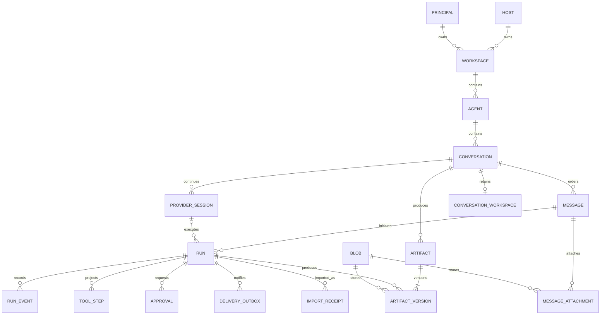

# AgentMeld data model and implementation blueprint

Updated 2026-09-18. **Design specification, not deployed schema.** This fills the implementation-planning gap left by the initial [Muse review](../research/muse-documentation-review.md). It owns entity relationships, database decisions, storage authority and migration acceptance. The [architecture](architecture.md) owns execution/security contracts; the [roadmap](roadmap.md) owns delivery order.

## What we are doing with the supplied blueprint

Use the source catalog to identify capabilities, relationships and recovery invariants. Translate those into our own small single-host model and preserve a traceable disposition for every source relation. Do not import Muse records, execute the ERD HTML, copy its PostgreSQL DDL or reproduce proprietary model internals. The 195 relations include mature product features, compatibility state and projections that our next workflow does not need.

Artifacts:

- [Core ERD and ownership](#core-erd) below.
- [Executable SQLite schema draft](data/core-schema.sql): exact core columns, types, nullability, keys, checks and indexes. Creates an empty design database only; the running application does not load it.
- [Complete 195-relation mapping](data/muse-schema-map.md): source relation, adopt/consolidate/defer/omit decision, destination and milestone. No unclassified relations.
- [Migration and verification plan](data/migration-plan.md): current POC mapping, cutover, rollback and delivery gates.
- [Source manifest](../research/muse-documentation-manifest.json): hashes of all 15 supplied files. No raw private export is redistributed.

## Core ERD

This is the target logical relationship model. SQL permits an artifact shell before its first version commits; it remains hidden from the ready Library until a version is available. A queued run may not yet have a provider session. A message may have no run, such as a migrated partial response or service notice. One conversation can have many successive native sessions, but at most one ready session and one executing turn. Queued follow-ups are separate from executing turns.

## Database decisions

SQLite WAL, one host-owned database per execution host, foreign keys enabled on every connection, bounded transactions and a single service writer. No database file inside agent containers. SQLite is an implementation decision; Muse's reported PostgreSQL namespaces become modules, not separate services or databases. Keep private operational diagnostics distinct from user-visible content. Introduce Postgres only for a later demonstrated multi-node need; no dual-dialect layer now.

The SQL draft uses service-issued UUID text IDs and UTC integer milliseconds. Display names, filesystem paths and provider IDs never authorize access. Most domain primary/foreign keys include `workspace_id`; message/session/run/artifact ownership also binds the conversation where needed. Every query additionally enforces current principal/host/resource grants. A valid foreign key is not a permission grant. Cross-host commands carry explicit host identity and route to that host's authority; no distributed SQLite writes.

Use relational columns for lifecycle, identity, ordering, ownership and query predicates. JSON holds versioned content blocks, frozen configuration and bounded structured details; JSON validity alone is not a schema or size check. The Rust/API boundary validates allowed fields, version, UTF-8, size and references. SQL constraints and transaction tests enforce complementary invariants.

## Core table contracts

The SQL is authoritative for draft field types/defaults; this table defines behavior and introduction order. All are planned, not installed.

| Tables | Authority and lifecycle | Delivery slice |
| --- | --- | --- |
| `schema_migrations` | Ordered version/checksum ledger; unknown or changed migration checksum blocks startup | M1a foundation |
| `principals`, `hosts`, `workspaces` | Single owner/system identity and host-bound security domain; no guest roles in this schema | M1a foundation; M2 pairing, M3 membership extensions |
| `agents` | Named agent and current configuration revision; frozen run configuration survives later edits; version-history extension in M2 | M1a |
| `conversations` | Stable thread, title, revision, archive/delete markers; fresh `/new` gets a new ID | M1a |
| `messages` | Ordered visible content, role, reply link and generation state; hidden harness traffic is not a chat message | M1a |
| `runs` | One admitted request with unique actor/request key and body digest, origin/response links, status and optional provider session; same key/different digest rejects | M1a |
| `provider_sessions` | Private native reference with exact adapter/protocol/model/config/grant binding; invalidation never silently resumes stale context | M1a |
| `conversation_workspaces` | Service-generated opaque storage key, quota and fenced lease; retains approved files when a worker exits | M1a |
| `blobs`, `message_attachments` | Original bytes and explicit attachment provenance; paths are service-owned and not client-selected | M1a persistence |
| `artifacts`, `artifact_versions` | Stable artifact identity with immutable versioned bytes, producer run and optional source manifest; MIME does not establish safe execution | M1b |
| `run_events` | Durable, versioned recorded events, unique source key where available, host-local sequence and visibility class | M1a basic status/message events; M1c detailed projection |
| `tool_steps` | Queryable projection of recorded calls/results, parent grouping and output references; missing events remain unknown | M1c |
| `approvals` | Host-owned exact-action decision and one-time consumption, tied to current policy/grant/lease and expiry | M1d |
| `delivery_outbox` | Immutable destination intent and independent attempt/receipt state; failure cannot change completed execution back to queued | M1e; M2 notification transport |
| `import_receipts` | Source-hash plus legacy-task mapping; idempotent import and reconciliation | M1a cutover |

Do not build all tables before delivering continuity. The schema is a target contract for the M1 sequence, not a prerequisite for another framework rewrite. The minimal first slice must still persist enough run/event identity to avoid losing provenance during subsequent migrations.

## Transactions and concurrency

1. **Admission:** validate current actor/host/conversation, request bounds and capability. In one transaction, reserve request key/digest, insert user message, enqueue run and append admission event. Return success only after commit. Duplicate keys return the original run; mismatched payloads return conflict. An atomic conditional claim plus the partial unique index serializes active turns.
2. **Provider start/resume:** acquire conversation workspace lease using expected generation. Match native session's adapter/config/grants; record chosen session on the run. Network calls occur outside SQLite transactions. On crash, reconcile the recorded attempt before starting another provider turn. A saved native reference alone is not proof that a turn did or did not run.
3. **Streaming:** persist bounded text batches and events with stable IDs before advertising their replay cursor. Never hold a DB transaction open while awaiting model output. Replayed events do not append duplicate text. An interruption can leave a saved partial response, visibly partial.
4. **Tool/approval:** record proposal/digest before dispatch. Check policy, grants, target, payload, expiry and lease in the approval-consumption/admission transaction. Dispatch uses the resulting single-use ticket. Unknown remote results require reconciliation; a failed connection cannot authorize retry of a completed action.
5. **Result ingestion:** write bytes to bounded private staging, validate/scan format as applicable, hash and flush, atomically promote on the same filesystem, then commit blob/version/event metadata. A completed run and notification intent commit together after required outputs exist. Filesystem and SQLite are not one atomic transaction: startup reconciles orphan staged/promoted blobs, retaining ambiguous data for review.
6. **Cancellation/restart:** revoke new dispatch first. Interrupt and clean native terminals or stop the owned worker; persist actual termination evidence. A lost worker yields interrupted/reconciling/needs-attention, not invented cancellation. Expired/stale lease owners cannot dispatch. Pending approvals remain pending only if their scope and expiry remain valid.
7. **Deletion:** mark target unavailable and invalidate retrieval/session/grant caches in a transaction; enqueue bounded purge work. Recheck access on every download, event stream and queued delivery. Physical erasure and backup expiry are separate recorded states. Append-only lifecycle metadata does not imply retaining deleted private payload forever.

## Activity, search and context

Activity is a read model joining runs, messages, recorded tool steps and artifact versions. Start with indexed queries; add materialized summaries only after measurement. Filter by authorized workspace/agent/host, order by host-local sequence/time and use stable cursors. Across hosts, keep origin and per-host cursor; do not pretend clocks create a global causal order. Details link to conversation/message/run and exact artifact version. Provider call keys must include session/turn scope before deduplication.

Search indexes only permitted visible messages/artifact metadata initially. Add SQLite FTS as a migration after evaluating tokenization; do not add a vector service. Deleted rows disappear from search in the same logical deletion transaction. Context manifests later record selected source IDs/revisions so correction/deletion invalidates summaries and native continuation. Native Codex compaction stays native; AgentMeld does not invent or expose private reasoning.

## Storage classes and retention

| Class | Location/authority | Lifecycle |
| --- | --- | --- |
| Metadata, grants, lifecycle records | Trusted host database | Consistent backup; content-aware deletion/redaction policy |
| Uploaded original bytes | Workspace-scoped blob store | Retained until explicit deletion/defined owner policy |
| Conversation working files | Separate bounded persistent volume/directory | Worker replacement preserves; no mount into another thread implicitly |
| Final output and source manifests | Immutable scoped blobs plus version rows | User-visible version history; referenced sources preserved for revision |
| Native provider state | Dedicated protected provider store | Never ordinary attachment, artifact or API response |
| Browser profile | Separate protected browser store | No automatic Library exposure or host-cookie import |
| Thumbnails/search/Activity projections | Rebuildable caches | Bounded retention; rebuild from currently authorized source |
| Staging, logs, build cache | Task-owned temporary storage | Bounded age/size and ownership-checked cleanup; never global pruning |

A source manifest references immutable source/input blob IDs with content hashes, not arbitrary host paths. Reusing an output in another conversation requires explicit authorized attachment; edits there create a new artifact rather than silently moving or changing the original conversation's artifact. Enforce quotas before upload, execution growth and export. Hash-based deduplication, if enabled, is scoped to a workspace and does not leak content existence across tenants. Do not promise a fixed trash/backup duration until selected and tested.

## Planned domain extensions, not missing core tables

| Domain | Additional records and relationships | Milestone and gate |
| --- | --- | --- |
| Identity/memory | Agent revisions; memory entries/revisions/claims; source references; supersession/deletion tombstones; context-source manifests | M2 P5/P10: correct/forget invalidates retrieval and stale continuation |
| Pairing/devices | Device identity, sessions, per-host grants, capability manifests, revocation version and last-seen | M2 P8: physical iPhone cellular and remote Mac-to-Mac, wrong-host denial |
| Scheduler | Definition revisions, trigger occurrence key, run link, next due, missed-run policy, delivery link | M2 P4: DST, duplicates, sleep/restart; never replay external writes blindly |
| Connections/skills | Provider account metadata, credential refs, tool scopes, skill versions and declared requirements | M2 reference connector; source text never creates grants |
| Collaboration | Membership and resource grants, shared context provenance, delegated run ancestry and narrowed budgets | M3: separate trust domain; no private session reuse |
| Goals/Ideas/Feed | Goal/progress, suggestion/admission, edition/source/feedback and budget records | M4: explicit product state separate from execution |
| Rich artifacts/apps | Build/source versions, isolated app data, capabilities and static share/version/revocation | M4: no application cookie/DB access from artifact origin |
| Maintenance | Definition, changed-input watermark, proposed revision, adoption/rollback, lease/budget | M4 opt-in; idle inference stays zero otherwise |
| Channels/media/payments | Routing/delivery bindings, media jobs; separate payment approval/provider receipts | M4 separately qualified; no raw payment secrets in these tables |
| Hosted usage | Tenant/meter/entitlement/invoice links and measured aggregate usage | M5; subscription tokens are not a fabricated API dollar bill |

Each extension gets its own reviewed DDL and migration when its slice begins. Deferring its physical tables does not remove its coverage from the [complete source mapping](data/muse-schema-map.md).
