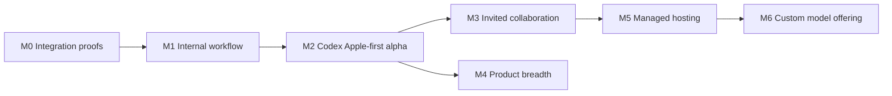

# AgentMeld delivery roadmap

Updated: 2026-09-18. Status: proposed sequence, not a schedule or effort estimate. M0 qualification is complete with [recorded limitations](../m0/completion-audit.md#closeout-decisions); the [local POC](../poc.md) is delivered. M1 and alpha remain incomplete. The [product specification](product-spec.md) owns intended behavior; [architecture](architecture.md) owns the proposed design.

## Immediate priority: prove product value

The owner explicitly redirected work on 2026-09-18: deliver a usable POC now.
The [local POC](../poc.md) uses the working unpatched Codex subscription runtime.
The failed-command event patch and expanded qualification are deferred. The
proof is a visible user workflow: attach data, ask for work, receive a useful
report, open/download it, and stop a running task. This precedes further M0
hardening. It does not claim the full alpha or all historical M0 gates passed.

## M0. Prove Codex subscription execution and its isolation boundary

**Outcome:** reduce the risks that could force a rewrite before building broad UI.

- Select and pin the Codex CLI and base execution image; qualify supported ChatGPT subscription authentication. Claude and Ollama are not M0 exit gates. Record their distribution licenses and supported authentication paths.
- Exercise minimal adapters against one disposable fixture workspace: streamed answer, bounded tool call, tool error, approval allow/deny, interruption, continuation after process replacement, and unavailable credentials/model.
- Confirm the native Codex processes and their child tools execute inside the intended sandbox. Verify they cannot read host files, application state, browser credentials, or another workspace.
- Prove the selected egress and credential-broker approach works with the Codex harness; document any exception rather than silently switching to host execution.
- Demonstrate a browser fixture, viewer, controlled human takeover, and fresh observation after resume. Select maintained viewer components from this evidence.
- Capture initial resource measurements, especially browser and harness memory. Validate minimum host requirements before writing installation promises.
- Verify configured models for every execution role and the exact loaded adapter/protocol version.

**Exit:** recorded adapter capability matrix, selected versions/licenses, fixture results, process/network-boundary evidence, and explicit limitations. If a harness cannot meet the boundary, resolve that integration before advertising support. M0 may use small disposable experiments; it does not justify shipping a bypass.

## M1. Complete one internal workflow

**Outcome:** one owner can complete useful work and recover it after restart.

Build the Rust API, owner authentication, durable task state, SQLite migrations, artifact store, worker supervisor, event stream, and one qualified native harness. Use Codex with the owner’s subscription; Claude Code and Ollama are deferred.

Add typed browser assignment/outcome records and separate result completion from notification delivery. Prove a notification failure after restart cannot replay completed actions; keep uncertain outcomes distinct from failure.

Establish the Mac-hosted service lifecycle and a versioned authenticated API for native macOS/iOS and local web clients. Client windows must not own task execution lifetime.

Build only the first conversation screen, inline approval, artifact preview, and computer inspector. Validate its first rendering against the [observed Muse design baseline](../design/muse-baseline.md) before expanding; include host selection and offline states while preserving the reference hierarchy. Use fixture data and clearly identify demonstrations.

**Acceptance scenario:** upload a small CSV, ask the agent to analyze it, open the resulting report, inspect the browser fixture, take over, resume, cancel a second run, restart the server, and reopen both records. The first task has its real result; the cancelled task is visibly cancelled. The artifact bytes and action record match what the UI reports.

**Exit:** actual local end-to-end demonstration plus denied-action, path-containment, viewer-auth, stream-reconnect, and restart-recovery checks. No public deployment or invitation feature.

## M2. Deliver a coherent self-hosted alpha

**Outcome:** Codex subscription execution works through the three-client product experience.

- Qualify Codex subscription login, streaming, native tools, approvals, cancellation and continuation; do not equate raw completion output with tool-loop support.
- Add named agents and side conversations, search, editable approved memory, skill requirements, artifact versions, and a tested MCP reference connector.
- Add bounded, source-linked work records under owner-approved memory: index-then-read retrieval, expected revisions, deletion tombstones and compaction refresh. Remembering work cannot dispatch it.
- Qualify durable result/event recovery for native and local web clients: stable IDs, grant rechecks, reconnect replay and honest accepted/completed states. Native messaging reply anchors and transport delivery receipts remain post-alpha.
- Add one-time/recurring tasks, Upcoming, execution history, missed-run policy, budget limits, and meaningful-change notifications.
- Finish the browser/computer experience, durable workspace/profile management, explicit recovery, and setup health checks.
- Deliver P8: native macOS and iOS apps plus local browser access to enrolled Mac hosts. Qualify explicit device pairing, secured cross-network access, explicit host selection, cross-client task state, approvals, artifacts, stop and reconnect on a physical iPhone.
- Require P8 across networks: iPhone over cellular and MacBook Air away from home control the Mac mini. Qualify a second host, wrong-host denial, independent grants, concurrent clients and offline behavior. No automatic task migration or failover.
- Select one secure remote path for commands, live viewer and artifacts. Compare a conventional private/reverse connection with a bounded Nostr transport candidate using the [connectivity assessment](../research/nostr-buzz-connectivity.md). No provider or new dependency is selected implicitly.
- Document Mac installation, Linux VM/container requirements, service lifecycle, sleep/offline behavior, model setup, backup/restore, upgrades and deletion. Qualify iOS installation/distribution before claiming installability.
- Resolve the project license before the open-source release; create contributing guidance and extension contracts based on implemented seams.

**Exit:** P1–P5 and P8 from the product spec pass against the qualified Codex integration and representative failure cases. Public documentation states each model's tested capabilities and setup costs. No unqualified “all models,” “fully secure,” “unlimited,” or “complete Muse parity” claims. All three clients address the selected host's durable agent state. Cellular iPhone and remote Mac-to-Mac control must be qualified before alpha completion. Messaging does not gate this milestone.

## M3. Add invited collaboration and stronger isolation

**Outcome:** another person can use a deliberately shared agent without gaining private account access.

- Qualify a dedicated VM or microVM trust boundary before admitting untrusted guest execution. A local owner may continue using the documented container profile.
- Add workspace membership, scoped invitations, roles/grants, attributed messages, mentions, threads, guest quotas, and separate shared sessions/computers.
- Add bounded agent handoffs with explicit task ownership, capability subsets, budgets, and wake-loop prevention.
- Implement revocation across downloads, live streams, model context, running jobs, schedules, and tool dispatch.
- Provide a guest-safe contribution workflow: draft changes/artifacts in a contribution workspace, then review/import into the owner's workspace.

**Exit:** P6 passes as owner, member, and guest. Cross-workspace resource access and malicious prompt/tool/skill inputs are tested. Verify private memory and provider continuations cannot reach a shared session. Obtain an independent security review before exposing the multiuser service to the public.

## M4. Expand the Muse-inspired product

**Outcome:** deeper personal assistance built on a reliable core.

Potential increments, ordered by observed demand:

1. Rich document and spreadsheet workflows with rendered output checks; image/audio/video providers and podcast artifacts.
2. Goals with progress timelines, monitoring stop conditions, personalized Ideas, and a configurable Feed generated within a budget.
3. Curated Microsoft/Google connections, additional MCP/OpenAPI tools, authenticated event triggers, and provider-specific permission controls.
4. Teach-by-demonstration that produces a reviewed draft skill; packaged skills and portable agent/team definitions.
5. iMessage and WhatsApp integrations; compare Linq, BlueBubbles, imsg and other providers only when this milestone begins. Add Windows, general remote-browser access, additional connectivity options (including evaluation of Tailscale), dictation, read-aloud, voice and push as separately qualified increments.
6. Optional credential autofill through opaque handles after origin/frame and secret-canary qualification across all observation paths; retain protected human login until then. Payment vault storage is a separate scope decision.
7. Supervised transaction integrations, location triggers, and outbound business calls after their access and operational requirements are established.

Add Claude Code and Ollama, then other model/harness integrations through contract conformance, not provider-specific logic scattered through the UI. Public discovery, federation, and direct Buzz interoperability remain separate proposals.

**Exit per increment:** one concrete user journey, source/provider limits, ordinary-user acceptance checks, recovery, and cost/resource measurements. Features do not ship merely because their navigation exists.

## M5. Offer managed hosting

**Outcome:** operate the same useful core as a paid service with demonstrated tenant isolation and recovery.

Select a hosting environment and VM provider using M3 evidence. Add supported remote authentication, tenant admission/resource limits, secure worker enrollment, metering, billing, deletion/retention policies, incident procedures, backups, and restore drills. Move metadata to Postgres and artifacts to object storage only when the chosen deployment requires it; verify migration parity.

Evaluate managed iMessage (including Linq) and remote browser adapters independently of the self-host baseline; verify identity provisioning, provider terms, data handling, outages and export.

Build an actual cost model from active/idle compute, browser usage, inference, storage, network, support, and recovery overhead. Hosted prices and packaging follow those measurements. Qualify provider usage terms for this offering; do not pool or resell personal subscription credentials.

**Exit:** threat review, cross-tenant tests, billing reconciliation, clean-tenant restore, load/soak tests, support runbooks, and live verification on the selected infrastructure under a separate deployment authorization.

## M6. Evaluate and offer a custom model

**Outcome:** an optional hosted model improves measured AgentMeld tasks at a justified operating cost.

Define a rights-cleared evaluation suite from synthetic, public, and explicitly contributed examples. Establish baselines for task success, unauthorized actions, tool correctness, latency, cost, and recovery. Evaluate routing/retrieval/prompting before fine-tuning a licensed base. Keep training consent separate from product access and billing. Do not collect customer conversations for this purpose by default.

**Exit:** documented dataset provenance, model license, evaluation results, deployment cost, regressions, and rollback. The model uses the same provider boundary; existing BYO integrations remain useful. Training a foundation model from scratch is not assumed.

## Local verification matrix

No GitHub Actions, self-hosted GitHub runners, or third-party CI connected to GitHub. Run the current M0 checks with `sh scripts/check-local.sh`; the broader matrix below remains the qualification target.

| Layer | Required evidence |
| --- | --- |
| Domain/policy | Permission intersections, denial precedence, approval expiry/replay, budget and lifecycle transitions |
| Provider contracts | Actual Codex subscription integration plus deterministic fake transport for timeout, malformed stream, stale callback and partial-output cases |
| Runtime isolation | Process placement, prohibited mounts, egress/SSRF, profile separation, limits, stale leases and worker ownership |
| Browser control | Single controller, takeover acknowledgement, disconnected viewer, credential-entry suppression, resume observation and cancellation |
| Durability | Crash between every action admission/result boundary, event replay, artifact partial writes, consistent restore and migration rollback |
| Scheduling | Duplicated triggers, owner revocation, DST changes, host sleep, missed runs and overlapping executions |
| Messaging, post-alpha | Real send/receive fixture, identity binding, wrong-chat denial, deduplication, outbound echoes, attachment validation, offline recovery and uncertain-send reconciliation |
| Apple clients, alpha | Physical iPhone pairing, Mac/local-web/iOS state consistency, revoked devices, stale requests, sleep/offline and reconnect; required cellular iPhone and remote Mac-to-Mac journeys, host selection and wrong-host denial |
| UI | First-screen visual inspection, responsive layout, keyboard operation, labels/focus, ordinary-user roles and honest state display |
| Artifacts/memory | Traversal/symlink/archive rejection, active-content isolation, version readback, ACL retrieval and deletion propagation |
| Efficiency | Idle and active RSS/CPU, cold/warm starts, p50/p95/p99/max latency, token use, screenshot traffic and long-running memory growth |
| Collaboration/hosting | Cross-tenant and guest adversarial cases, grant revocation, shared-session isolation, quota enforcement and restore drills |

## Dependency order

M4 can advance incrementally while hosting readiness develops. Evaluation design for M6 may begin earlier using rights-cleared fixtures; it must not introduce hidden data collection. Milestone order is more reliable than a calendar estimate before M0 establishes integration effort.

## Checkpoint and next action

The [M0 exit checklist](../m0/exit-checklist.md) owns current qualification status and next actions. The detailed history below records earlier batches; it does not restore deferred provider or messaging requirements.

M0 now contains experimental Rust contracts, synthetic transport checks and real offline native-process probes. The GitHub repository has been created. See [M0 evidence](../m0/results.md) for exact capabilities and limitations and [local instructions](../m0/README.md) for reproduction.

The headless Chromium fixture now passes with the documented browser seccomp policy. The isolated viewer/takeover fixture also passes, with its mediation limits documented. The viewer now uses a durable Rust journal and passes paused-restart tests. A separated host supervisor now passes storage-boundary and payload-dispatch checks. Durable scoped approval and a real Codex dynamic-tool callback now pass with a synthetic Responses provider, with host and container resource samples recorded. A durable reconnect ledger, private-screen suppression and a whole-container termination probe now extend recovery qualification. Local worker identity now binds immutable runtime IDs; explicit grants cover two dynamic tools, and viewer HTTP cancellation confirms whole-container termination. A local-only Ollama preflight and opt-in qualification runner now pass synthetic HTTP tests with durable Rust approvals; installed cloud aliases are rejected. Six supervisor crash boundaries now pass through two restarts; malformed and torn journals are rejected without modifying the evidence. The same recovery suite now passes in the rebuilt Linux ARM64 container, and all four runtime probes pass with stricter worker resource/process binding. Power-loss and live-worker reconciliation remain unqualified. A third native tool now reads one approved workspace text file with a 64 KiB bound, strict UTF-8 and host-validated content hashes; nine real Codex callback scenarios pass against a synthetic provider. Validated native results now persist in a bounded Rust archive before settlement, with scoped readback and failure-path tests. Journal format 6 retains result references with settlement and supports scope-bound retrieval after restart. A [read-only loopback result endpoint](../m0/result-access.md) now qualifies scoped capabilities, absolute expiry, revocation and HTTP readback after supervisor replacement. A [recovery evidence assessor](../m0/recovery-assessment.md) now reports exact pending/settled bindings without retrying or clearing uncertain work. Fresh scope-bound worker inventory now feeds recovery assessments; the cancellation probe confirms absent workers do not clear uncertain outcomes after Rust supervisor replacement. A [durable reviewed recovery path](../m0/reviewed-recovery.md) now records accepted output or closed-unknown outcomes separately from normal settlement; stale/replayed reviews fail and cancellation survives restart. Production retrieval authorization, authenticated owner/task integration and whole-host recovery remain open. Next: Codex subscription authentication and isolated execution, broader native tools and production recovery. License selection remains open. Claude, Ollama and messaging are deferred. M0 has not exited; M1 UI work has not begun.

## OpenInstinct audit delta

See the [2026-09-18 pinned-source audit](../research/openinstinct-audit.md). The Rust/SQLite/native-harness design and milestone order remain. The changes specify browser outcomes, result/report separation, bounded work memory and transport comparison. They do not mark M0 complete or add cloud dependencies. Next implementation should integrate authenticated owner/task state with these contracts; outstanding live provider and recovery qualification remains required.

## Current scope override: Apple-first alpha

The [2026-09-18 decision](../decisions/2026-09-18-apple-first-alpha.md) supersedes earlier messaging gates in research/checkpoints. M0 no longer waits on an iMessage identity or transport. M2 targets macOS, local browser and iOS. The next product step is the authenticated Mac-hosted service/API and one complete workflow; qualify native clients before broad feature expansion. Messaging, Windows and general remote access follow alpha. Away-from-home iPhone and Mac-to-Mac control are confirmed alpha gates and require one qualified secure connection path.

## Provider scope correction

Brad reconfirmed on 2026-09-18: alpha is Codex-only using ChatGPT subscription authentication. Claude Code and Ollama are post-alpha. Existing offline adapter fixtures remain historical evidence, not alpha gates. The temporary Ollama download attempt was interrupted after this correction; no local inference was run. See [subscription qualification](../m0/codex-subscription.md).
