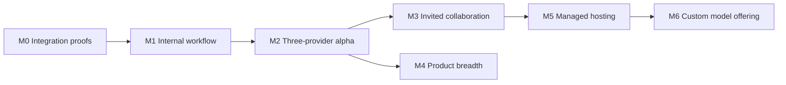

# AgentMeld delivery roadmap

Date: 2026-09-17. Status: proposed sequence, not a schedule or effort estimate. M0 experiments have started; see [current evidence](../m0/results.md). The [product specification](product-spec.md) owns intended behavior; [architecture](architecture.md) owns the proposed design.

## M0. Prove the three integrations and execution boundary

**Outcome:** reduce the risks that could force a rewrite before building broad UI.

- Select and pin the Codex CLI, Claude SDK/runtime, a suitable Ollama tool model, and base execution image. Record their distribution licenses and supported authentication paths.
- Exercise minimal adapters against one disposable fixture workspace: streamed answer, bounded tool call, tool error, approval allow/deny, interruption, continuation after process replacement, and unavailable credentials/model.
- Confirm the native Claude/Codex processes and their child tools execute inside the intended sandbox. Verify they cannot read host files, application state, browser credentials, or another workspace.
- Prove the selected egress and credential-broker approach works with each native harness; document any exception rather than silently switching to host execution.
- Demonstrate a browser fixture, viewer, controlled human takeover, and fresh observation after resume. Select maintained viewer components from this evidence.
- Capture initial resource measurements, especially browser and harness memory. Validate minimum host requirements before writing installation promises.
- Qualify the optional iMessage Mac transport with an explicitly authorized test identity: inbound/outbound correlation, attachment handling, sender binding, echo suppression, reconnect, and truthful delivery states. This does not authorize using Brad's current Messages account during specification work.

**Exit:** recorded adapter capability matrix, selected versions/licenses, fixture results, process/network-boundary evidence, and explicit limitations. If a harness cannot meet the boundary, resolve that integration before advertising support. M0 may use small disposable experiments; it does not justify shipping a bypass.

## M1. Complete one internal workflow

**Outcome:** one owner can complete useful work and recover it after restart.

Build the Rust API, owner authentication, durable task state, SQLite migrations, artifact store, worker supervisor, event stream, and one qualified native harness. Start with Codex if M0 confirms its protocol fit; this ordering does not drop Claude Code or Ollama from launch.

Build only the first conversation screen, inline approval, artifact preview, and computer inspector. Validate its first rendering against the Muse-inspired hierarchy before expanding. Use fixture data and clearly identify demonstrations.

**Acceptance scenario:** upload a small CSV, ask the agent to analyze it, open the resulting report, inspect the browser fixture, take over, resume, cancel a second run, restart the server, and reopen both records. The first task has its real result; the cancelled task is visibly cancelled. The artifact bytes and action record match what the UI reports.

**Exit:** actual local end-to-end demonstration plus denied-action, path-containment, viewer-auth, stream-reconnect, and restart-recovery checks. No public deployment or invitation feature.

## M2. Deliver a coherent self-hosted alpha

**Outcome:** the requested three integrations work through the same product experience.

- Qualify Claude Code and Ollama alongside Codex; do not equate raw completion output with tool-loop support.
- Add named agents and side conversations, search, editable approved memory, skill requirements, artifact versions, and a tested MCP reference connector.
- Add one-time/recurring tasks, Upcoming, execution history, missed-run policy, budget limits, and meaningful-change notifications.
- Finish the browser/computer experience, durable workspace/profile management, explicit recovery, and setup health checks.
- Deliver P7: optional paired Mac bridge for two-way iMessage, allowlisted one-to-one chats, attachment limits, offline queue, and authenticated approval deep links. Include setup and macOS permission requirements; the web/core installation remains usable without a Mac bridge.
- Qualify private HTTPS access for mobile review links, or clearly use computer-side approval when no phone-reachable route exists. No implicit public exposure. Validate local message readback and history catch-up because transport webhooks alone are not authenticated durable ingress.
- Document local Linux installation, VM-backed macOS/Windows options, model selection, failure recovery, backup/restore, upgrades, and data deletion.
- Resolve the project license before the open-source release; create contributing guidance and extension contracts based on implemented seams.

**Exit:** P1–P5 and P7 from the product spec pass against the three qualified integrations and representative failure cases. Public documentation states each model's tested capabilities and setup costs. No unqualified “all models,” “fully secure,” “unlimited,” or “complete Muse parity” claims. iMessage can queue a task for any configured agent; model/harness failure does not produce a false delivered-result notification.

## M3. Add invited collaboration and stronger isolation

**Outcome:** another person can use a deliberately shared agent without gaining private account access.

- Qualify a dedicated VM or microVM trust boundary before admitting untrusted guest execution. A local owner may continue using the documented container profile.
- Add workspace membership, scoped invitations, roles/grants, attributed messages, mentions, threads, guest quotas, and separate shared sessions/computers.
- Add bounded agent handoffs with explicit task ownership, capability subsets, budgets, and wake-loop prevention.
- Implement revocation across downloads, live streams, model context, running jobs, schedules, and tool dispatch.
- Provide a guest-safe contribution workflow: draft changes/artifacts in a contribution workspace, then review/import into the owner's workspace.

**Exit:** P6 passes as owner, member, and guest. Cross-workspace resource access and malicious prompt/tool/skill inputs are tested. Verify private memory and provider continuations cannot reach a shared session. Obtain an independent security review before exposing the multiuser service to the public.

## M4. Expand the Muse-inspired product

**Outcome:** deeper personal assistance built on a reliable core.

Potential increments, ordered by observed demand:

1. Rich document and spreadsheet workflows with rendered output checks; image/audio/video providers and podcast artifacts.
2. Goals with progress timelines, monitoring stop conditions, personalized Ideas, and a configurable Feed generated within a budget.
3. Curated Microsoft/Google connections, additional MCP/OpenAPI tools, authenticated event triggers, and provider-specific permission controls.
4. Teach-by-demonstration that produces a reviewed draft skill; packaged skills and portable agent/team definitions.
5. Dictation, read-aloud, responsive/PWA improvements, optional Tauri desktop shell, mobile/push, and additional messaging channels beyond the initial iMessage integration.
6. Supervised transaction integrations, location triggers, and outbound business calls after their access and operational requirements are established.

Add more model/harness integrations through contract conformance, not provider-specific logic scattered through the UI. Public discovery, federation, and direct Buzz interoperability remain separate proposals.

**Exit per increment:** one concrete user journey, source/provider limits, ordinary-user acceptance checks, recovery, and cost/resource measurements. Features do not ship merely because their navigation exists.

## M5. Offer managed hosting

**Outcome:** operate the same useful core as a paid service with demonstrated tenant isolation and recovery.

Select a hosting environment and VM provider using M3 evidence. Add supported remote authentication, tenant admission/resource limits, secure worker enrollment, metering, billing, deletion/retention policies, incident procedures, backups, and restore drills. Move metadata to Postgres and artifacts to object storage only when the chosen deployment requires it; verify migration parity.

Build an actual cost model from active/idle compute, browser usage, inference, storage, network, support, and recovery overhead. Hosted prices and packaging follow those measurements. Qualify provider usage terms for this offering; do not pool or resell personal subscription credentials.

**Exit:** threat review, cross-tenant tests, billing reconciliation, clean-tenant restore, load/soak tests, support runbooks, and live verification on the selected infrastructure under a separate deployment authorization.

## M6. Evaluate and offer a custom model

**Outcome:** an optional hosted model improves measured AgentMeld tasks at a justified operating cost.

Define a rights-cleared evaluation suite from synthetic, public, and explicitly contributed examples. Establish baselines for task success, unauthorized actions, tool correctness, latency, cost, and recovery. Evaluate routing/retrieval/prompting before fine-tuning a licensed base. Keep training consent separate from product access and billing. Do not collect customer conversations for this purpose by default.

**Exit:** documented dataset provenance, model license, evaluation results, deployment cost, regressions, and rollback. The model uses the same provider boundary; existing BYO integrations remain useful. Training a foundation model from scratch is not assumed.

## Local verification matrix

No GitHub Actions, self-hosted GitHub runners, or third-party CI connected to GitHub. Run the current M0 checks with `sh scripts/check-local.sh`; the broader matrix below remains the qualification target.

| Layer | Required evidence |
| --- | --- |
| Domain/policy | Permission intersections, denial precedence, approval expiry/replay, budget and lifecycle transitions |
| Provider contracts | Three actual integrations plus deterministic fake transport for timeout, malformed stream, stale callback and partial-output cases |
| Runtime isolation | Process placement, prohibited mounts, egress/SSRF, profile separation, limits, stale leases and worker ownership |
| Browser control | Single controller, takeover acknowledgement, disconnected viewer, credential-entry suppression, resume observation and cancellation |
| Durability | Crash between every action admission/result boundary, event replay, artifact partial writes, consistent restore and migration rollback |
| Scheduling | Duplicated triggers, owner revocation, DST changes, host sleep, missed runs and overlapping executions |
| iMessage | Real send/receive fixture, identity binding, wrong-chat denial, deduplication, outbound echoes, attachment validation, offline recovery and uncertain-send reconciliation |
| UI | First-screen visual inspection, responsive layout, keyboard operation, labels/focus, ordinary-user roles and honest state display |
| Artifacts/memory | Traversal/symlink/archive rejection, active-content isolation, version readback, ACL retrieval and deletion propagation |
| Efficiency | Idle and active RSS/CPU, cold/warm starts, p50/p95/p99/max latency, token use, screenshot traffic and long-running memory growth |
| Collaboration/hosting | Cross-tenant and guest adversarial cases, grant revocation, shared-session isolation, quota enforcement and restore drills |

## Dependency order

M4 can advance incrementally while hosting readiness develops. Evaluation design for M6 may begin earlier using rights-cleared fixtures; it must not introduce hidden data collection. Milestone order is more reliable than a calendar estimate before M0 establishes integration effort.

## Checkpoint and next action

M0 now contains experimental Rust contracts, synthetic transport checks and real offline native-process probes. The GitHub repository has been created. See [M0 evidence](../m0/results.md) for exact capabilities and limitations and [local instructions](../m0/README.md) for reproduction.

The headless Chromium fixture now passes with the documented browser seccomp policy. The isolated viewer/takeover fixture also passes, with its mediation limits documented. The viewer now uses a durable Rust journal and passes paused-restart tests. A separated host supervisor now passes storage-boundary and payload-dispatch checks. Durable scoped approval and a real Codex dynamic-tool callback now pass with a synthetic Responses provider, with host and container resource samples recorded. Next: authenticated worker identity, broader native tool mediation, authenticated provider execution and a real local Ollama model. License selection and a designated iMessage test identity remain open. M0 has not exited; M1 UI work has not begun.
